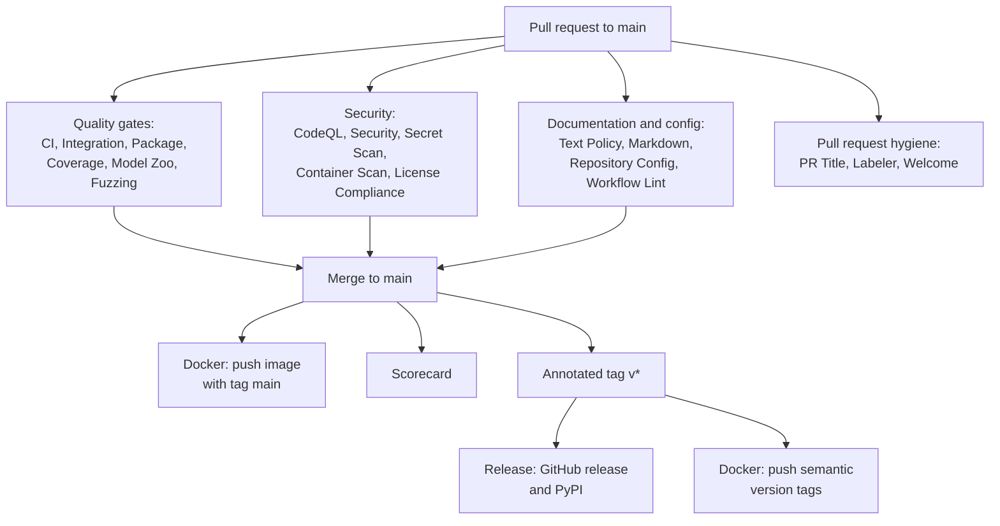

<!--
This Source Code Form is subject to the terms of the Mozilla Public
License, v. 2.0. If a copy of the MPL was not distributed with this
file, You can obtain one at https://mozilla.org/MPL/2.0/.

=============================================================================
Project     : Unbihexium
File        : docs/operations/ci_cd.md
Title       : Continuous Integration and Delivery
Author      : Olaf Yunus Laitinen Imanov <yunus.z.imanov@helsinki.fi>
Affiliation : University of Helsinki
Copyright   : 2025-2026 Unbihexium OSS Foundation and contributors
Licence     : Mozilla Public License 2.0, see LICENSE.txt
Format      : Markdown (CommonMark with GitHub Flavored Markdown extensions)
=============================================================================
-->

# Continuous Integration and Delivery

| Field | Value |
| --- | --- |
| Document | UBX-DOC-901 |
| Version | 2.0 |
| Status | Active |
| Last reviewed | 2026-09-24 |
| Owner | Unbihexium maintainers (see [MAINTAINERS.md](../../MAINTAINERS.md)) |
| Applies to | Unbihexium 1.0.1 and the main branch, the 24 workflows under .github/workflows |

## Abstract

This document describes the continuous integration and delivery of Unbihexium as implemented by the 24 GitHub Actions workflows in [.github/workflows/](../../.github/workflows/): what starts each workflow, which jobs it runs, what they check, whether a failure blocks a change, and which artefacts they publish. It also explains the conventions shared by all workflows (pinned actions, hashed installs, least-privilege tokens, concurrency) and how contributors run the same checks locally. It is intended for contributors who need to understand a failing check, for the maintainer who changes the pipeline and for auditors. The tables were compiled from the workflow files at the date of review; when a workflow changes, this document MUST be updated in the same pull request.

## Contents

- [1. Introduction](#1-introduction)
- [2. Common Conventions](#2-common-conventions)
- [3. Workflow Inventory](#3-workflow-inventory)
- [4. Quality Gates for Pull Requests](#4-quality-gates-for-pull-requests)
- [5. Security Workflows](#5-security-workflows)
- [6. Delivery Workflows](#6-delivery-workflows)
- [7. Repository Maintenance Workflows](#7-repository-maintenance-workflows)
- [8. Schedules](#8-schedules)
- [9. Running the Checks Locally](#9-running-the-checks-locally)
- [10. Changing a Workflow](#10-changing-a-workflow)
- [References](#references)

## 1. Introduction

### 1.1 Scope

Continuous integration (CI) here means the checks that run on pull requests to `main` and on pushes to `main`. Continuous delivery (CD) means the workflows that publish artefacts: the container image on every push to `main` and on version tags, and the Python distributions and GitHub release on version tags. There is no automatic deployment to any running service.

### 1.2 Conventions

The key words MUST, MUST NOT, SHOULD, SHOULD NOT and MAY in this document are to be interpreted as described in RFC 2119 [1] and RFC 8174 [2] when, and only when, they appear in all capitals.

### 1.3 Pipeline Overview



## 2. Common Conventions

All workflows follow the same rules, which are also checked by the OpenSSF Scorecard ([supply_chain_security.md](../security/supply_chain_security.md)):

- **Header and comments.** Every workflow file starts with the MPL-2.0 notice and a header with an abstract, and every line carries a comment; `.github/scripts/check_config_style.py` enforces this.
- **Pinned actions.** Every `uses:` reference is pinned by full commit SHA with the version as a trailing comment. Dependabot updates both weekly.
- **Hashed installs.** Python tools and dependencies are installed with `pip install --require-hashes` from the lock files under [.github/requirements/](../../.github/requirements/) and [requirements.txt](../../requirements.txt); the package itself is added with `pip install --no-deps -e .`. The only exception is the smoke test in package.yml, which installs the built wheel like a user would.
- **CPU-only PyTorch.** Test jobs install PyTorch from the hashed lock `requirements-ci-torch.txt` (CPU wheels from the PyTorch index) before the test lock.
- **Least privilege.** Every workflow sets `permissions: contents: read` (Scorecard: `read-all`) and widens it per job; the full table is in [secrets_and_tokens.md](../security/secrets_and_tokens.md).
- **Runners.** All jobs run on GitHub-hosted `ubuntu-latest` runners. Most use CPython 3.14; the test matrices cover 3.10 to 3.14, and fuzzing uses 3.12, for which atheris publishes wheels.
- **Concurrency.** Most workflows group runs by workflow and ref and cancel superseded pull request runs, while runs on `main` always finish.
- **Branch filters.** Push triggers are limited to `main`, except the Release workflow (tags `v*`), the Docker workflow (`main` and tags `v*`) and Torch Lock (any branch, path-filtered).

## 3. Workflow Inventory

The table lists every workflow, its triggers and its jobs. "PR" means `pull_request` to `main`, "push" a push to `main`, "PR target" the `pull_request_target` event, "manual" `workflow_dispatch`; schedules are in UTC.

| Workflow file | Name | Triggers | Jobs |
| --- | --- | --- | --- |
| [ci.yml](../../.github/workflows/ci.yml) | CI | PR, push | `lint`, `typecheck`, `test` (Python 3.10 to 3.14) |
| [codeql.yml](../../.github/workflows/codeql.yml) | CodeQL | PR, push, Tuesday 03:00, manual | `analyze` (`python`, `actions`) |
| [container-scan.yml](../../.github/workflows/container-scan.yml) | Container Scan | PR and push touching `Dockerfile`, `.dockerignore`, `pyproject.toml`, `requirements*.txt`; Monday 03:00; manual | `grype` |
| [coverage.yml](../../.github/workflows/coverage.yml) | Coverage | PR, push | `coverage` |
| [docker.yml](../../.github/workflows/docker.yml) | Docker | PR, push, tags `v*` | `build-and-push` |
| [fuzz.yml](../../.github/workflows/fuzz.yml) | Fuzzing | PR and push touching `src/unbihexium/io/**`, `fuzz/**`, the fuzz lock or the workflow; Wednesday 02:00; manual | `fuzz` (`geojson`, `stac`) |
| [integration.yml](../../.github/workflows/integration.yml) | Integration Tests | PR, push, Monday 06:00 | `integration` (Python 3.10 to 3.14), `e2e`, `api-test` |
| [labeler.yml](../../.github/workflows/labeler.yml) | Labeler | PR target (opened, synchronize, reopened) | `label` |
| [labels.yml](../../.github/workflows/labels.yml) | Labels | PR and push touching `.github/labels.yml` or the workflow; manual | `sync` |
| [license-compliance.yml](../../.github/workflows/license-compliance.yml) | License Compliance | PR, push, Monday 04:00, manual | `headers`, `reuse`, `dependencies` |
| [links.yml](../../.github/workflows/links.yml) | Links | Monday 05:00, manual | `lychee` |
| [markdown.yml](../../.github/workflows/markdown.yml) | Markdown | PR and push touching `**/*.md`, `.markdownlint.yaml` or the identifier check; manual | `markdownlint`, `document-ids` |
| [model-zoo.yml](../../.github/workflows/model-zoo.yml) | Model Zoo | PR and push touching `model_zoo/**`, `src/unbihexium/zoo/**`, `src/unbihexium/ai/models/**`, the check script or the workflow; Monday 05:00; manual (with a `rebuild` input) | `consistency`, `reproducibility` |
| [package.yml](../../.github/workflows/package.yml) | Package | PR, push, manual | `build`, `smoke-test` (Python 3.10 and 3.14) |
| [pr-title.yml](../../.github/workflows/pr-title.yml) | PR Title | PR target (opened, edited, reopened, synchronize) | `conventional-title` |
| [release.yml](../../.github/workflows/release.yml) | Release | tags `v*` | `release` |
| [repo-config.yml](../../.github/workflows/repo-config.yml) | Repository Config | PR and push touching `.github/**`, any YAML file, `.yamllint.yml`, `CITATION.cff` or `codemeta.json`; manual | `schemas`, `security-insights` |
| [scorecard.yml](../../.github/workflows/scorecard.yml) | OpenSSF Scorecard | push, Monday 06:00, branch protection rule changes | `analysis` |
| [secret-scan.yml](../../.github/workflows/secret-scan.yml) | Secret Scan | PR, push, manual | `trufflehog` |
| [security.yml](../../.github/workflows/security.yml) | Security | PR, push, Sunday 00:00 | `bandit`, `pip-audit`, `dependency-review` (PR only) |
| [stale.yml](../../.github/workflows/stale.yml) | Stale | daily 03:30, manual | `stale` |
| [text-policy.yml](../../.github/workflows/text-policy.yml) | Text Policy | PR, push, manual | `text-policy`, `python-style`, `commit-messages` (PR only) |
| [torch-lock.yml](../../.github/workflows/torch-lock.yml) | Torch Lock | push to any branch touching the torch lock input, the lock or the workflow; Thursday 05:00; manual | `compile` |
| [welcome.yml](../../.github/workflows/welcome.yml) | Welcome | first issue opened, PR target (opened) | `welcome` |
| [workflow-lint.yml](../../.github/workflows/workflow-lint.yml) | Workflow Lint | PR and push touching `.github/workflows/**`; manual | `actionlint` |

## 4. Quality Gates for Pull Requests

### 4.1 Code Quality and Tests

| Workflow and job | What it checks | Fails the check |
| --- | --- | --- |
| CI, `lint` | `ruff check src/ --config pyproject.toml` and `ruff format --check src/` | Yes |
| CI, `typecheck` | `pyright src/` in standard mode on CPython 3.13, against the hashed type check lock (test environment, pyright and the SciPy type stubs) and CPU PyTorch | Yes |
| CI, `test` | `pytest tests/ --tb=short` on CPython 3.10, 3.11, 3.12, 3.13 and 3.14 with CPU PyTorch and the optional backends | Yes |
| Integration Tests, `integration` | `pytest tests/integration/` on CPython 3.10 to 3.14; GDAL system packages are installed on a best-effort basis | Yes |
| Integration Tests, `e2e` | `pytest tests/e2e/` on CPython 3.14, after `integration` | Yes |
| Integration Tests, `api-test` | Starts `create_app()` with uvicorn on 127.0.0.1:8000 for at most 30 seconds and polls `GET /health` until it answers | Yes |
| Coverage, `coverage` | `pytest tests/ --cov=src/unbihexium` and upload of `coverage.xml` to Codecov (flag `unittests`) with the `CODECOV_TOKEN` secret | Only if the tests fail; upload errors are ignored, and the Codecov statuses in [codecov.yml](../../codecov.yml) are informational |
| Package, `build` | `python -m build --no-isolation` with the hash-pinned hatchling of the tools lock, `twine check --strict`, and that `LICENSE.txt` and `NOTICE` are shipped in the wheel and the sdist; uploads `dist/` as the artifact `dist` (7 days) | Yes |
| Package, `smoke-test` | Installs the wheel into a fresh virtual environment on CPython 3.10 and 3.14, imports the package and runs `unbihexium --help` outside the checkout | Yes |

### 4.2 Model Zoo

The Model Zoo workflow runs `.github/scripts/check_model_zoo.py` in two jobs. `consistency` checks that the catalogue, the generated manifests, the model cards and the published digests agree, without PyTorch. `reproducibility` rebuilds starter weights with CPU PyTorch and compares their digests with [src/unbihexium/zoo/digests.json](../../src/unbihexium/zoo/digests.json): pull requests rebuild the tiny variants, the weekly run rebuilds all 520 models, and a manual run can choose `tiny`, `base`, `large`, `mega` or `all`. All 520 models are untrained starter models with deterministic weights, except the 28 models of the 7 spectral index families, which compute exact formulas; the workflow checks integrity and reproducibility, not accuracy.

### 4.3 Documentation, Text and Configuration

| Workflow and job | What it checks |
| --- | --- |
| Text Policy, `text-policy` | `.github/scripts/check_text_policy.py`: tracked text files are English only and contain no emojis and no em dashes |
| Text Policy, `python-style` | `check_python_style.py` and `check_config_style.py`: headers, footers and line comments in Python and configuration files |
| Text Policy, `commit-messages` | Every commit message of the pull request is free of emojis, em dashes, horizontal bars and the listed Turkish letters |
| Markdown, `markdownlint` | `markdownlint-cli@0.49.1` over every Markdown file with [.markdownlint.yaml](../../.markdownlint.yaml) |
| Markdown, `document-ids` | `.github/scripts/check_document_ids.py`: every controlled document has a numbered identifier that is unique and matches the [Document Register](../document_register.md) and [docs/toc.md](../toc.md) |
| Repository Config, `schemas` | Issue forms, issue chooser, workflows, Dependabot, `CITATION.cff`, the Compose file and Codecov against their JSON Schemas with check-jsonschema; `codemeta.json` is valid JSON; `yamllint --strict`; the remaining `.github` YAML files parse |
| Repository Config, `security-insights` | [security-insights.yml](../../security-insights.yml) against the OpenSSF Security Insights 2.2.0 schema with cue |
| Workflow Lint, `actionlint` | actionlint 1.7.12 (archive pinned by SHA-256) with shellcheck over all workflows |
| License Compliance | See Section 5 |
| PR Title, `conventional-title` | The title matches `type(scope): description` with the types feat, fix, docs, style, refactor, perf, test, build, ci, chore, revert and deps; the scope is optional |

Whether a failing check blocks the merge is decided by the branch protection rules of the repository, which are settings outside the source tree; [CONTRIBUTING.md](../../CONTRIBUTING.md) requires all checks to pass before a pull request is merged.

## 5. Security Workflows

| Workflow and job | What it checks | Blocking |
| --- | --- | --- |
| CodeQL, `analyze` | CodeQL `security-extended` for Python and GitHub Actions; results in code scanning | Alerts in code scanning |
| Security, `bandit` | `bandit -c pyproject.toml -r src/` | Yes |
| Security, `pip-audit` | `pip-audit --require-hashes --disable-pip` on `requirements.txt` and `requirements-dev.txt` | Yes |
| Security, `dependency-review` | New dependencies with high or critical advisories or denied licences ([.github/dependency-review-config.yml](../../.github/dependency-review-config.yml)) | Yes |
| Secret Scan, `trufflehog` | TruffleHog 3.97.6 over the new commits, verified secrets only | Yes |
| Container Scan, `grype` | Builds the image locally and scans it with Grype; SARIF to code scanning (category `grype-container`) | Yes, on critical findings with a fix |
| Fuzzing, `fuzz` | atheris targets `fuzz_geojson.py` and `fuzz_stac.py`, two minutes per target (twenty weekly); crashing inputs uploaded as artifacts | Yes, on a crash |
| License Compliance, `headers` | `check_license_headers.py`: `LICENSE.txt` and the MPL-2.0 notice of every source file | Yes |
| License Compliance, `reuse` | `reuse lint` (REUSE Specification) | Yes |
| License Compliance, `dependencies` | Licences of the installed runtime lock via pip-licenses, checked by `check_dependency_licenses.py` | Yes |
| OpenSSF Scorecard, `analysis` | Repository security practices; results to the public Scorecard API and code scanning | No |

These controls and their limits are described in detail in [supply_chain_security.md](../security/supply_chain_security.md), and the handling of findings in [vulnerability_management.md](../security/vulnerability_management.md).

## 6. Delivery Workflows

### 6.1 Docker

[docker.yml](../../.github/workflows/docker.yml) builds the image from the repository [Dockerfile](../../Dockerfile) with Buildx and the GitHub Actions layer cache. On pull requests it only builds, to prove that the Dockerfile works. On pushes to `main` and on version tags it logs in to `ghcr.io` with `GITHUB_TOKEN` (`packages: write`), pushes `ghcr.io/unbihexium-oss/unbihexium` with tags computed by `docker/metadata-action` (the branch name, `MAJOR.MINOR.PATCH` and `MAJOR.MINOR` for version tags, and `sha-<short commit>`), and stores an SPDX SBOM of the pushed image as the artifact `sbom-docker.spdx.json`. Using the image is described in [docker.md](docker.md).

### 6.2 Release

[release.yml](../../.github/workflows/release.yml) runs when a tag `v*` is pushed. Its single job builds the sdist and the wheel, writes `SHA256SUMS.txt`, creates GitHub artifact attestations with SLSA build provenance, signs the distributions with Sigstore (`.sigstore.json` bundles), exports the provenance as `unbihexium-<tag>.intoto.jsonl`, creates the GitHub release with generated notes, and uploads the distributions to PyPI with the `PYPI_API_TOKEN` secret. The procedure around it is in [releasing.md](releasing.md).

### 6.3 Torch Lock

[torch-lock.yml](../../.github/workflows/torch-lock.yml) is a delivery aid for the CI itself: it compiles the hashed lock of the CPU build of PyTorch against the PyTorch index, prints it, uploads it as the artifact `requirements-ci-torch` (30 days) and fails when it differs from the committed file. The maintainer copies the printed file into the repository.

## 7. Repository Maintenance Workflows

| Workflow | Behaviour |
| --- | --- |
| Labeler | Adds labels to pull requests by changed paths ([.github/labeler.yml](../../.github/labeler.yml)); never removes labels; does not check out the pull request |
| Labels | Creates and updates labels from [.github/labels.yml](../../.github/labels.yml); dry run on pull requests; never deletes labels |
| Links | Checks all Markdown links with lychee ([.github/lychee.toml](../../.github/lychee.toml)); never fails; posts the report to an open issue titled "Broken links report" |
| Stale | Marks issues after 60 days and pull requests after 45 days without activity, closes them 14 days later; drafts and items labelled `security`, `confirmed`, `blocked`, `help wanted`, `good first issue`, `breaking-change`, `compliance` (issues) or `security`, `blocked`, `breaking-change`, `dependencies` (pull requests) are exempt |
| Welcome | Comments on a person's first issue or pull request with pointers to SUPPORT.md, SECURITY.md and CONTRIBUTING.md |

## 8. Schedules

| Time (UTC) | Workflow |
| --- | --- |
| Daily 03:30 | Stale |
| Sunday 00:00 | Security |
| Monday 03:00 | Container Scan |
| Monday 04:00 | License Compliance |
| Monday 05:00 | Links, Model Zoo (all 520 models) |
| Monday 06:00 | Integration Tests, OpenSSF Scorecard |
| Tuesday 03:00 | CodeQL |
| Wednesday 02:00 | Fuzzing (twenty minutes per target) |
| Thursday 05:00 | Torch Lock |

Scheduled runs catch problems that appear without a code change: new advisories, new dependency releases, broken external links and platform drift in the model weights. GitHub disables scheduled workflows in repositories without activity for 60 days [3].

## 9. Running the Checks Locally

The [Makefile](../../Makefile) mirrors the CI checks; `make help` lists every target, and `make check` runs `lint`, `format-check`, `type-check`, `test`, `licence`, `text-policy`, `doc-ids`, `yaml-lint` and `model-zoo`. The pre-commit hooks in [.pre-commit-config.yaml](../../.pre-commit-config.yaml) run the same tool versions as CI (`make pre-commit`). The main commands can also be run directly in a development environment installed with `make install-dev`:

```bash
ruff check src/ --config pyproject.toml
ruff format --check src/
python .github/scripts/check_text_policy.py
python .github/scripts/check_model_zoo.py
pytest tests/ --tb=short
```

Run on 2026-09-24 in a CPython 3.13 environment with all extras, the first four commands reported `All checks passed!`, `114 files already formatted`, `Text policy check passed.` and `Model zoo check passed.`. Markdown files are checked with `npx --yes markdownlint-cli@0.49.1 --config .markdownlint.yaml "**/*.md" --ignore node_modules`, which requires Node.js.

## 10. Changing a Workflow

A pull request that adds or changes a workflow:

- MUST pin every action by full commit SHA with the version as a comment, and install Python tools only from hashed lock files;
- MUST declare `permissions: contents: read` at the top level and grant additional permissions per job only;
- MUST NOT check out or run pull request code in a `pull_request_target` workflow, and SHOULD set `persist-credentials: false` on checkouts;
- MUST pass Workflow Lint and Repository Config, and SHOULD keep the header, abstract and line comments that `check_config_style.py` requires;
- MUST update this document, and [SECURITY.md](../../SECURITY.md) and [supply_chain_security.md](../security/supply_chain_security.md) when a security control changes.

Contribution rules in general are in [CONTRIBUTING.md](../../CONTRIBUTING.md).

## References

[1] Bradner, S. Key words for use in RFCs to Indicate Requirement Levels. RFC 2119. 1997. <https://www.rfc-editor.org/rfc/rfc2119>

[2] Leiba, B. Ambiguity of Uppercase vs Lowercase in RFC 2119 Key Words. RFC 8174. 2017. <https://www.rfc-editor.org/rfc/rfc8174>

[3] GitHub. Disabling and enabling a workflow. 2026. <https://docs.github.com/en/actions/managing-workflow-runs-and-deployments/managing-workflow-runs/disabling-and-enabling-a-workflow>

<!--
=============================================================================
End of file docs/operations/ci_cd.md
Part of Unbihexium (https://github.com/unbihexium-oss/unbihexium).
Cite the project as described in CITATION.cff.
=============================================================================
-->
