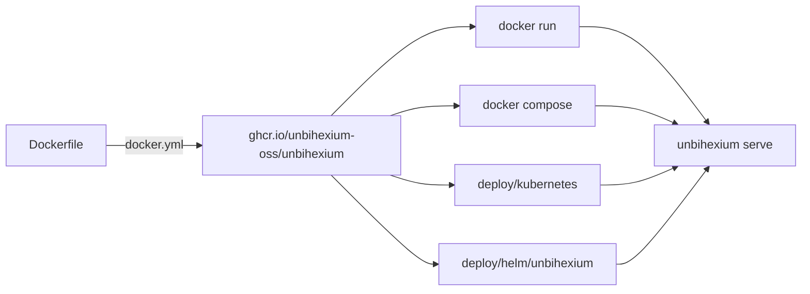

<!--
This Source Code Form is subject to the terms of the Mozilla Public
License, v. 2.0. If a copy of the MPL was not distributed with this
file, You can obtain one at https://mozilla.org/MPL/2.0/.

=============================================================================
Project     : Unbihexium
File        : docs/operations/docker.md
Title       : Container Image and Deployment
Author      : Olaf Yunus Laitinen Imanov <yunus.z.imanov@helsinki.fi>
Affiliation : University of Helsinki
Copyright   : 2025-2026 Unbihexium OSS Foundation and contributors
Licence     : Mozilla Public License 2.0, see LICENSE.txt
Format      : Markdown (CommonMark with GitHub Flavored Markdown extensions)
=============================================================================
-->

# Container Image and Deployment

| Field | Value |
| --- | --- |
| Document | UBX-DOC-902 |
| Version | 2.0 |
| Status | Active |
| Last reviewed | 2026-09-24 |
| Owner | Unbihexium maintainers (see [MAINTAINERS.md](../../MAINTAINERS.md)) |
| Applies to | The main branch: Dockerfile, docker-compose.yml, .env.example and deploy/ |

## Abstract

This document describes how the Unbihexium container image is built and published, what it contains, and how to run its REST service with Docker, Docker Compose, plain Kubernetes manifests or the Helm chart of the repository. It is written for operators who deploy the service and for contributors who change the deployment files. Every statement refers to a file in the repository; the commands were checked as stated in [Section 8](#8-verification-of-the-deployment-files). The service runs the models of the model zoo, which are untrained starter models except the 28 models of the 7 spectral index families, so its predictions carry no meaning until a model has been trained (see [README.md](../../README.md) and [RESPONSIBLE_USE.md](../../RESPONSIBLE_USE.md)).

## Contents

- [1. Introduction](#1-introduction)
- [2. The Container Image](#2-the-container-image)
- [3. Running the Image with Docker](#3-running-the-image-with-docker)
- [4. Docker Compose](#4-docker-compose)
- [5. Configuration of the Service](#5-configuration-of-the-service)
- [6. Kubernetes Manifests](#6-kubernetes-manifests)
- [7. Helm Chart](#7-helm-chart)
- [8. Verification of the Deployment Files](#8-verification-of-the-deployment-files)
- [9. Security Considerations](#9-security-considerations)
- [10. Changing the Deployment Files](#10-changing-the-deployment-files)
- [References](#references)

## 1. Introduction

### 1.1 Scope

The document covers the [Dockerfile](../../Dockerfile), [.dockerignore](../../.dockerignore), [docker-compose.yml](../../docker-compose.yml), [.env.example](../../.env.example), the plain manifests in [deploy/kubernetes/deployment.yaml](../../deploy/kubernetes/deployment.yaml), the Helm chart in [deploy/helm/unbihexium/](../../deploy/helm/unbihexium/Chart.yaml) and the workflows that build and check them. The REST API itself (routes, request formats, limits) is described in [docs/model_zoo/inference.md](../model_zoo/inference.md) and in the OpenAPI document that the service publishes at `/docs`.

### 1.2 Conventions

The key words MUST, MUST NOT, SHOULD, SHOULD NOT and MAY are to be interpreted as described in RFC 2119 [1] and RFC 8174 [2] when, and only when, they appear in capitals.

### 1.3 Overview



Every deployment path starts the same process, `unbihexium serve`, which runs the FastAPI application of `unbihexium.serving` with uvicorn.

## 2. The Container Image

### 2.1 Build Stages

The [Dockerfile](../../Dockerfile) has two stages, both based on `python:3.14.7-slim-trixie` (CPython 3.14.7 on Debian 13), pinned by the digest of the multi-platform manifest list so that a rebuild uses exactly the reviewed base image.

| Stage | Work |
| --- | --- |
| `builder` | Creates a virtual environment in `/opt/venv`; installs the dependencies from two hashed lock files (Section 2.2) with `--only-binary=:all: --require-hashes`; builds the wheel of the package without build isolation in a separate environment `/opt/build` that holds only the hash-pinned build backend (`requirements-build.txt`), and installs it into `/opt/venv` without dependencies; runs `pip check` and imports `torch`, `onnxruntime` and `unbihexium.serving.app` so that a broken environment fails the build |
| `runtime` | Copies `/opt/venv`, creates the user `unbihexium` (UID and GID 1000), sets `UNBIHEXIUM_CACHE=/home/unbihexium/.cache/unbihexium`, declares that directory as a volume, exposes port 8000 and defines a health check that imports the package |

The default command is `unbihexium --help`. The image carries OCI annotations (title, description, version, revision, creation time, licence `MPL-2.0`, source) [3]; the version, revision and creation time come from the build arguments `VERSION`, `VCS_REF` and `BUILD_DATE`.

### 2.2 Contents and Lock Files

| Lock file | Source index | Contents |
| --- | --- | --- |
| [.github/requirements/requirements-docker.txt](../../.github/requirements/requirements-docker.txt) | PyPI | Runtime dependencies of the package, the `onnx` and `serving` extras and the dependencies of PyTorch |
| [.github/requirements/requirements-ci-torch.txt](../../.github/requirements/requirements-ci-torch.txt) | PyTorch CPU index | The CPU build of PyTorch, installed with `--no-deps` |

Every distribution in both files carries its SHA-256 hash, so pip refuses any file that differs from the reviewed one. `make lock` regenerates the first file; the Torch Lock workflow ([torch-lock.yml](../../.github/workflows/torch-lock.yml)) compiles the second on a GitHub runner, because the PyTorch index is not reachable from every environment. The build backend hatchling comes from a third hashed lock file, [.github/requirements/requirements-build.txt](../../.github/requirements/requirements-build.txt), and is not copied into the runtime stage. [.dockerignore](../../.dockerignore) sends only these three files, `pyproject.toml`, `README.md`, the licence and notice files and `src/` to the build.

The image therefore contains the command line interface, the REST service, PyTorch (CPU) and ONNX Runtime (CPU execution provider). It contains no model weights: when a model is used for the first time, the library builds its deterministic starter weights from the catalogue, checks them against the published SHA-256 digest and stores them under `UNBIHEXIUM_CACHE`. Nothing is downloaded. The image contains no CUDA libraries; GPU inference requires a custom image with a CUDA build of PyTorch.

### 2.3 Publication

[.github/workflows/docker.yml](../../.github/workflows/docker.yml) builds the image on pull requests (build only), on pushes to `main` and on version tags, and pushes it to the GitHub Container Registry as `ghcr.io/unbihexium-oss/unbihexium`.

| Event | Tags |
| --- | --- |
| Push to `main` | `main`, `sha-<short commit>` |
| Version tag `vMAJOR.MINOR.PATCH` | `MAJOR.MINOR.PATCH`, `MAJOR.MINOR`, `sha-<short commit>` |

There is no `latest` tag. The workflow stores an SPDX software bill of materials of the pushed image as the workflow artifact `sbom-docker.spdx.json`, and [container-scan.yml](../../.github/workflows/container-scan.yml) scans the image with Grype. The image is not signed. The platform is `linux/amd64`.

Deployments SHOULD use a version tag or pin the image by digest (`ghcr.io/unbihexium-oss/unbihexium@sha256:...`); the `main` tag moves with every push to the main branch.

## 3. Running the Image with Docker

```bash
docker pull ghcr.io/unbihexium-oss/unbihexium:main
docker run --rm ghcr.io/unbihexium-oss/unbihexium:main unbihexium info
docker run --rm -p 8000:8000 ghcr.io/unbihexium-oss/unbihexium:main \
    unbihexium serve --host 0.0.0.0 --port 8000
```

`--host 0.0.0.0` is required inside a container, because the default host of the configuration is `127.0.0.1`, which is not reachable through a published port. The service answers `GET /health` and publishes its OpenAPI documentation at `http://localhost:8000/docs`.

Built models are kept between runs by mounting a volume at the cache directory:

```bash
docker run --rm -p 8000:8000 \
    -v unbihexium-cache:/home/unbihexium/.cache/unbihexium \
    ghcr.io/unbihexium-oss/unbihexium:main unbihexium serve --host 0.0.0.0 --port 8000
```

A local image is built from the repository root with `docker build -t unbihexium:local .`, optionally with `--build-arg VERSION=...`, `--build-arg VCS_REF="$(git rev-parse HEAD)"` and `--build-arg BUILD_DATE=...`. The Makefile targets `docker-build`, `docker-run` and `docker-api` wrap these commands.

## 4. Docker Compose

[docker-compose.yml](../../docker-compose.yml) defines one service, `api`, which builds the image from the repository and runs `unbihexium serve --host 0.0.0.0 --port 8000 --proxy-headers`.

| Setting | Value |
| --- | --- |
| Port | host 8000 to container 8000 |
| Model cache | named volume `unbihexium-cache` at `/home/unbihexium/.cache/unbihexium` |
| Health check | `GET http://127.0.0.1:8000/health` every 30 seconds |
| Restart policy | `unless-stopped` |
| Hardening | read-only root file system, `/tmp` as tmpfs, all Linux capabilities dropped, `no-new-privileges` |
| Logging | `json-file`, rotated at 10 MB, three files |
| Settings | optional `.env` file next to the Compose file (Section 5) |

```bash
docker compose up --build -d
docker compose logs -f api
curl http://localhost:8000/health
docker compose down
```

`docker compose down --volumes` also deletes the model cache.

## 5. Configuration of the Service

The service reads the layered configuration of `unbihexium.config`: defaults, an optional YAML file (`UNBIHEXIUM_CONFIG` or `unbihexium serve --config`), then environment variables of the form `UNBIHEXIUM_<SECTION>__<KEY>`; command line options of `unbihexium serve` win over all of them. [.env.example](../../.env.example) lists the variables; [docs/getting_started/configuration.md](../getting_started/configuration.md) describes every setting.

| Variable | Default | Effect |
| --- | --- | --- |
| `UNBIHEXIUM_CACHE` | `~/.cache/unbihexium` (image: `/home/unbihexium/.cache/unbihexium`) | Root of the local model store |
| `UNBIHEXIUM_LOG_LEVEL` | `WARNING` | Log level of the package and of uvicorn |
| `UNBIHEXIUM_SERVING__HOST`, `UNBIHEXIUM_SERVING__PORT` | `127.0.0.1`, `8000` | Listen address, unless `--host` or `--port` is given |
| `UNBIHEXIUM_SERVING__API_KEY` | unset | When set, every route except `/health` requires it in the `X-API-Key` header |
| `UNBIHEXIUM_SERVING__RATE_LIMIT_PER_MINUTE` | `0` (off) | Requests per minute and client |
| `UNBIHEXIUM_SERVING__CORS_ORIGINS` | every origin | Allowed CORS origins, comma-separated |
| `UNBIHEXIUM_SERVING__MAX_REQUEST_BYTES` | `10485760` | Largest accepted request body |
| `UNBIHEXIUM_SERVING__MODEL_CACHE_SIZE` | `4` | Models kept loaded in memory |
| `UNBIHEXIUM_MODEL__DEVICE`, `UNBIHEXIUM_MODEL__BACKEND` | `cpu`, `auto` | Torch device and inference backend of the service |

An API key MUST be set whenever the service is reachable from outside the host or cluster, and it SHOULD come from a secret store rather than a committed file.

## 6. Kubernetes Manifests

[deploy/kubernetes/deployment.yaml](../../deploy/kubernetes/deployment.yaml) holds four documents for use without Helm:

| Resource | Purpose |
| --- | --- |
| Deployment `unbihexium-api` | Two pods running `unbihexium serve --host 0.0.0.0 --port 8000 --proxy-headers` from `ghcr.io/unbihexium-oss/unbihexium:main`; startup, readiness and liveness probes on `/health`; requests of 500m CPU and 1 GiB memory, a 3 GiB memory limit |
| Service `unbihexium-api` | ClusterIP, port 80 to the named container port `http` |
| HorizontalPodAutoscaler `unbihexium-api` | 2 to 5 replicas at 70 percent of the CPU request; requires the Kubernetes metrics server |
| PodDisruptionBudget `unbihexium-api` | At least one pod stays available during voluntary evictions |

The pods run as UID and GID 1000 with `runAsNonRoot`, the `RuntimeDefault` seccomp profile, a read-only root file system, no Linux capabilities, no privilege escalation and no mounted service account token. The model store is an `emptyDir` volume of at most 2 GiB per pod: a pod that is replaced rebuilds the models it needs, which is deterministic and verified against the published digests.

```bash
kubectl apply -f deploy/kubernetes/deployment.yaml
kubectl rollout status deployment/unbihexium-api
kubectl port-forward service/unbihexium-api 8000:80
curl http://127.0.0.1:8000/health
```

External access depends on the ingress controller or gateway of the cluster and is not part of the plain manifests; the Helm chart can create an Ingress (Section 7). The header of the manifest file shows how to supply `UNBIHEXIUM_SERVING__API_KEY` from a Secret. For production, the image SHOULD be pinned to a version tag or digest.

## 7. Helm Chart

### 7.1 Contents

The chart in [deploy/helm/unbihexium/](../../deploy/helm/unbihexium/Chart.yaml) renders the same resources as the plain manifests and adds a dedicated ServiceAccount, an optional Secret for the API key, an optional Ingress and a test pod for `helm test`. Its templates are in `templates/`; [values.yaml](../../deploy/helm/unbihexium/values.yaml) documents every value. It requires Kubernetes 1.25 or newer.

| Template | Resource | Condition |
| --- | --- | --- |
| `deployment.yaml` | Deployment | always |
| `service.yaml` | Service | always |
| `serviceaccount.yaml` | ServiceAccount without an automatically mounted token | `serviceAccount.create` |
| `secret.yaml` | Secret with the API key | `server.apiKey.value` set and no `server.apiKey.existingSecret` |
| `hpa.yaml` | HorizontalPodAutoscaler | `autoscaling.enabled` |
| `pdb.yaml` | PodDisruptionBudget | `podDisruptionBudget.enabled` |
| `ingress.yaml` | Ingress | `ingress.enabled`; rendering fails without `ingress.hosts` |
| `tests/test-connection.yaml` | Pod that requests `/health` through the Service | `helm test` |

### 7.2 Main Values

| Value | Default | Meaning |
| --- | --- | --- |
| `image.repository`, `image.tag`, `image.digest` | `ghcr.io/unbihexium-oss/unbihexium`, `main`, empty | Image; a digest pins it and replaces the tag |
| `server.logLevel` | `INFO` | `UNBIHEXIUM_LOG_LEVEL` |
| `server.apiKey.value` / `existingSecret` | empty | API key, stored in a chart Secret or read from an existing one |
| `server.rateLimitPerMinute`, `server.corsOrigins`, `server.maxRequestBytes`, `server.modelCacheSize` | `0`, all origins, `10485760`, `4` | Serving settings passed as `UNBIHEXIUM_SERVING__*` variables |
| `cache.sizeLimit`, `cache.persistentVolumeClaim` | `2Gi`, empty | Size of the emptyDir model store, or an existing ReadWriteMany claim shared by all pods |
| `autoscaling.*` | enabled, 2 to 5 replicas, 70 percent CPU | Autoscaler |
| `ingress.*` | disabled | Ingress class, annotations, hosts and TLS sections |

### 7.3 Installation

```bash
helm lint --strict deploy/helm/unbihexium
helm install unbihexium deploy/helm/unbihexium \
    --set image.tag=main \
    --set server.apiKey.existingSecret=unbihexium-api-key
kubectl rollout status deployment/unbihexium
helm test unbihexium
```

With an Ingress:

```bash
helm upgrade --install unbihexium deploy/helm/unbihexium \
    --set ingress.enabled=true --set ingress.className=nginx \
    --set 'ingress.hosts={api.example.org}' \
    --set 'ingress.tls[0].secretName=unbihexium-tls' \
    --set 'ingress.tls[0].hosts={api.example.org}'
```

The notes that Helm prints after the installation show how to reach the service.

## 8. Verification of the Deployment Files

The workflow [.github/workflows/deploy.yml](../../.github/workflows/deploy.yml) runs when a deployment file changes:

- `helm lint --strict` of the chart with the default values and with the Ingress enabled;
- `kubeconform -strict` of the plain manifests and of two renderings of the chart (default values, and every optional resource enabled) against the Kubernetes 1.31 schemas [4];
- a check that the chart refuses an Ingress without host names;
- `docker compose config --quiet` of the Compose file.

The image build is checked by [docker.yml](../../.github/workflows/docker.yml) on every pull request, and the command that every deployment starts, `unbihexium serve`, is exercised by the API job of [integration.yml](../../.github/workflows/integration.yml), which also runs an exact index model and a starter detector through `POST /predict`. These checks do not start a Kubernetes cluster; the chart test (`helm test`) is the check for a real installation.

## 9. Security Considerations

- The image and the pods run as an unprivileged user with a read-only root file system; only the model store and `/tmp` are writable.
- Dependencies and the base image are pinned by hash and digest (Section 2); Dependabot proposes updates, and Grype scans the published image.
- The service has no authentication unless an API key is configured (Section 5). Operators MUST configure one, or restrict network access by other means, before exposing the service.
- `--proxy-headers` makes uvicorn trust `X-Forwarded-*` headers; it MUST only be used behind a proxy or ingress that sets them.
- Vulnerabilities are reported as described in [SECURITY.md](../../SECURITY.md).

## 10. Changing the Deployment Files

- The chart's `appVersion` and `version` MUST be raised together with the package version on a release (see [releasing.md](releasing.md)).
- A change to a template or to values MUST keep `helm lint --strict` and the kubeconform checks of Section 8 passing; run them locally with the commands of [deploy.yml](../../.github/workflows/deploy.yml).
- A change to the dependencies of the image is made in `pyproject.toml` or `requirements-ci-test.in` and applied with `make lock`, never by editing a lock file by hand.
- Helm templates carry the repository header and footer in a template comment (`{{- /* ... */ -}}`), because a `#` comment would be copied into every rendered manifest.

## References

[1] Bradner, S. Key words for use in RFCs to Indicate Requirement Levels. RFC 2119. 1997. <https://www.rfc-editor.org/rfc/rfc2119>

[2] Leiba, B. Ambiguity of Uppercase vs Lowercase in RFC 2119 Key Words. RFC 8174. 2017. <https://www.rfc-editor.org/rfc/rfc8174>

[3] Open Container Initiative. Image Format Specification: Pre-Defined Annotation Keys. 2024. <https://github.com/opencontainers/image-spec/blob/main/annotations.md>

[4] Yann Hamon. kubeconform: a fast Kubernetes manifests validator. 2025. <https://github.com/yannh/kubeconform>

<!--
=============================================================================
End of file docs/operations/docker.md
Part of Unbihexium (https://github.com/unbihexium-oss/unbihexium).
Cite the project as described in CITATION.cff.
=============================================================================
-->
