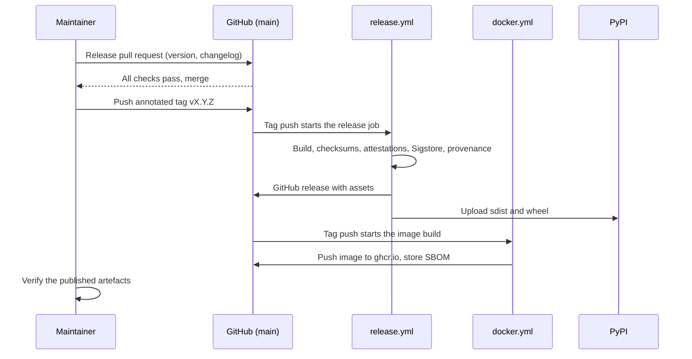

<!--
This Source Code Form is subject to the terms of the Mozilla Public
License, v. 2.0. If a copy of the MPL was not distributed with this
file, You can obtain one at https://mozilla.org/MPL/2.0/.

=============================================================================
Project     : Unbihexium
File        : docs/operations/releasing.md
Title       : Release Procedure
Author      : Olaf Yunus Laitinen Imanov <yunus.z.imanov@helsinki.fi>
Affiliation : University of Helsinki
Copyright   : 2025-2026 Unbihexium OSS Foundation and contributors
Licence     : Mozilla Public License 2.0, see LICENSE.txt
Format      : Markdown (CommonMark with GitHub Flavored Markdown extensions)
=============================================================================
-->

# Release Procedure

| Field | Value |
| --- | --- |
| Document | UBX-DOC-OPS-RELEASING |
| Version | 2.0 |
| Status | Active |
| Last reviewed | 2026-09-24 |
| Owner | Unbihexium maintainers (see [MAINTAINERS.md](../../MAINTAINERS.md)) |
| Applies to | Unbihexium 1.0.1 and the main branch, releases built by .github/workflows/release.yml |

## Abstract

This document is the step-by-step procedure for publishing a release of Unbihexium: choosing the version number, updating every place that records it, updating the changelog, tagging, what the release workflow does after the tag is pushed, how the published artefacts are checked, and what to do when something goes wrong. It is written for the maintainer who performs a release and for auditors who want to trace a published file back to its source. The policy behind the procedure (Semantic Versioning, deprecation, supported series) is defined in [VERSIONING.md](../../VERSIONING.md), whose Section 9 this document expands; in case of conflict, VERSIONING.md prevails. Packaging uses the PEP 517 backend hatchling and the `build` frontend; no other packaging tool is involved.

## Contents

- [1. Introduction](#1-introduction)
- [2. Preconditions](#2-preconditions)
- [3. Choosing the Version Number](#3-choosing-the-version-number)
- [4. The Release Pull Request](#4-the-release-pull-request)
- [5. Tagging](#5-tagging)
- [6. The Release Workflow](#6-the-release-workflow)
- [7. Container Image](#7-container-image)
- [8. Post-Release Checks](#8-post-release-checks)
- [9. Handling Failures](#9-handling-failures)
- [10. Release History](#10-release-history)
- [References](#references)

## 1. Introduction

### 1.1 Conventions

The key words MUST, MUST NOT, SHOULD, SHOULD NOT and MAY in this document are to be interpreted as described in RFC 2119 [1] and RFC 8174 [2] when, and only when, they appear in all capitals.

### 1.2 Roles

Releases are made by the lead maintainer, who holds administrator rights on the repository and controls the `PYPI_API_TOKEN` secret ([GOVERNANCE.md](../../GOVERNANCE.md)). The project has no fixed release schedule; security fixes are released as described in [vulnerability_management.md](../security/vulnerability_management.md).

### 1.3 Overview



## 2. Preconditions

Before starting, the maintainer MUST make sure that:

1. every check on the head of `main` has passed, including the scheduled runs of the past week (Security, Container Scan, Model Zoo, Integration Tests); see [ci_cd.md](ci_cd.md);
2. the `[Unreleased]` section of [CHANGELOG.md](../../CHANGELOG.md) is complete, and every merged pull request with user-visible changes has an entry;
3. no open security advisory is waiting for this release, or, if one is, the fix is included and the advisory is ready to be published with the release;
4. the lock files are current (`make lock-check`), and the Torch Lock workflow reports no difference;
5. the `PYPI_API_TOKEN` repository secret is valid and scoped to the `unbihexium` project on PyPI.

## 3. Choosing the Version Number

The new version is derived from the changes since the last tag by the rules of [VERSIONING.md](../../VERSIONING.md), Section 4: MAJOR for incompatible changes, MINOR for compatible additions and deprecations, PATCH for compatible fixes; the highest applicable increment wins. At the date of review the `[Unreleased]` section contains breaking changes (for example the relicensing to MPL-2.0 and the new return type of `read_geotiff`), so the next release MUST be 2.0.0. Pre-releases, if used, take the PEP 440 suffixes `aN`, `bN` or `rcN` [3].

The model catalogue has its own version (currently 2.0.0 in [src/unbihexium/zoo/catalog.yaml](../../src/unbihexium/zoo/catalog.yaml)), incremented independently under [VERSIONING.md](../../VERSIONING.md), Section 6. A library release does not change it unless the catalogue changed.

## 4. The Release Pull Request

### 4.1 Version Fields

The release is prepared in a pull request to `main`, from a branch such as `release/v2.0.0`, with a title such as `chore(release): 2.0.0`. It MUST update the following fields, as listed in [VERSIONING.md](../../VERSIONING.md), Section 9.1:

| File | Fields |
| --- | --- |
| [pyproject.toml](../../pyproject.toml) | `version` in `[project]`; this static value is the version of the built distributions |
| [src/unbihexium/_version.py](../../src/unbihexium/_version.py) | `__version__` and `__version_tuple__` |
| [CITATION.cff](../../CITATION.cff) | `version`, `date-released` and the version-specific `identifiers` (release URL) |
| [codemeta.json](../../codemeta.json) | `version`, `softwareVersion` and `dateModified` |
| [deploy/helm/unbihexium/Chart.yaml](../../deploy/helm/unbihexium/Chart.yaml) | `version` and `appVersion` |
| [Dockerfile](../../Dockerfile) | default of the `VERSION` build argument (see [docker.md](docker.md)) |

The release workflow does not compare the tag with the version in `pyproject.toml`, so a forgotten bump produces distributions with the old version number and a failed PyPI upload. The following check, run from the repository root, prints the version recorded in the four metadata files that define the package and its citation:

```python
import json
import re
import tomllib
from pathlib import Path

found = {
    "pyproject.toml": tomllib.loads(Path("pyproject.toml").read_text())["project"]["version"],
    "src/unbihexium/_version.py": re.search(r'__version__ = "([^"]+)"', Path("src/unbihexium/_version.py").read_text())[1],
    "CITATION.cff": re.search(r"^version: (\S+)", Path("CITATION.cff").read_text(), re.M)[1],
    "codemeta.json": json.loads(Path("codemeta.json").read_text())["version"],
}
for place, version in found.items():
    print(f"{place:28} {version}")
print("consistent" if len(set(found.values())) == 1 else "MISMATCH")
```

On the main branch at the date of review (Python 3.11 or newer, for `tomllib`) it prints:

```text
pyproject.toml               1.0.1
src/unbihexium/_version.py   1.0.1
CITATION.cff                 1.0.1
codemeta.json                1.0.1
consistent
```

The remaining occurrences of the old version, including the Helm chart, the Dockerfile and documents that name the current release (README.md, SUPPORT.md, CITATION.md, SECURITY.md and the issue templates), are found with:

```bash
git grep -n -F "1.0.1"
```

Each hit is then either updated or left deliberately, for example in the changelog history.

### 4.2 Changelog

Following the conventions of [CHANGELOG.md](../../CHANGELOG.md), Section 1, and Keep a Changelog [4]:

1. rename `[Unreleased]` to the new version with the release date in ISO 8601 form, for example `[2.0.0] - 2026-10-01`, and add a short summary paragraph;
2. start a new, empty `[Unreleased]` section above it;
3. update the comparison links at the end of the file: `[Unreleased]` compares the new tag with `HEAD`, and the new version compares the previous tag with the new one;
4. make sure breaking changes, deprecations and security fixes are listed under their headings.

### 4.3 Related Documents

The supported versions table in [SECURITY.md](../../SECURITY.md) and the supported series in [VERSIONING.md](../../VERSIONING.md), Section 10, MUST be updated when a new MINOR or MAJOR series starts, because only the latest series receives fixes.

### 4.4 Local Checks

Before the pull request is merged, the distributions SHOULD be built and checked locally in an environment with the `build` and `twine` packages:

```bash
python -m build
python -m twine check --strict dist/*
```

Run on 2026-09-24 against the main branch, `python -m build` reported `Successfully built unbihexium-1.0.1.tar.gz and unbihexium-1.0.1-py3-none-any.whl`, and `twine check --strict` reported `PASSED` for both files. The pull request MUST pass every required check before it is merged; the Package workflow repeats these checks and installs the wheel on CPython 3.10 and 3.14.

## 5. Tagging

After the release pull request is merged, the maintainer updates the local `main`, confirms that it is the merged commit, and creates and pushes an annotated tag named `v` followed by the version:

```bash
git switch main
git pull --ff-only
git tag -a v2.0.0 -m "Release v2.0.0"
git push origin v2.0.0
```

Tags MUST NOT be moved, deleted and recreated, or reused once pushed ([VERSIONING.md](../../VERSIONING.md), Section 2.3), because the signatures, attestations and PyPI files of a release are bound to the tagged commit. Only tags that match `v*` start the release workflow.

## 6. The Release Workflow

### 6.1 Steps

The tag push starts [.github/workflows/release.yml](../../.github/workflows/release.yml). Its single job `release` runs on `ubuntu-latest` with `contents: write`, `id-token: write` and `attestations: write`, and executes:

| Step | Action | Result |
| --- | --- | --- |
| Check out | `actions/checkout` at the tagged commit | Source tree |
| Set up Python | `actions/setup-python`, CPython 3.14 | Interpreter |
| Install build tools | `pip install --require-hashes -r .github/requirements/requirements-ci-tools.txt` | Hash-pinned `build` |
| Build package | `python -m build --no-isolation` (hatchling from the hashed tools lock) | `dist/unbihexium-<version>.tar.gz`, `dist/unbihexium-<version>-py3-none-any.whl` |
| Generate checksums | `sha256sum` over `dist/` | `checksums/SHA256SUMS.txt` |
| Generate attestations | `actions/attest-build-provenance` on `dist/*` | GitHub artifact attestation with SLSA provenance v1 [5] |
| Copy and sign | `sigstore/gh-action-sigstore-python` on copies in `signed/` | `<file>.sigstore.json` per distribution [6] |
| Export provenance | `jq -c '.dsseEnvelope'` on the attestation bundle | `signed/unbihexium-<tag>.intoto.jsonl` |
| Create GitHub release | `softprops/action-gh-release` with generated notes | Release with distributions, bundles, provenance and checksums |
| Publish to PyPI | `pypa/gh-action-pypi-publish` with `PYPI_API_TOKEN` | Files on <https://pypi.org/project/unbihexium/> |

The signing and the attestation use the short-lived OIDC identity of the job, so no key is stored anywhere; see [secrets_and_tokens.md](../security/secrets_and_tokens.md). PyPI publication uses the long-lived API token; trusted publishing is not configured.

### 6.2 Release Notes

The release notes are generated by GitHub from the pull requests merged since the previous tag and grouped by label according to [.github/release.yml](../../.github/release.yml): Breaking changes, Security, New features, Bug fixes, Model zoo, Performance, Compliance and licensing, Documentation, Build, CI and containers, Dependencies, and Other changes. Pull requests labelled `ignore-for-release`, `duplicate`, `invalid` or `wontfix` are omitted. The maintainer SHOULD edit the release on GitHub afterwards to add a link to the changelog section and to highlight breaking changes.

## 7. Container Image

The same tag push starts [.github/workflows/docker.yml](../../.github/workflows/docker.yml), which pushes `ghcr.io/unbihexium-oss/unbihexium` with the tags `MAJOR.MINOR.PATCH`, `MAJOR.MINOR` and `sha-<short commit>`, and stores an SPDX SBOM of the pushed image as a workflow artifact. The image is not signed. Building, tagging and running the image are described in [docker.md](docker.md).

## 8. Post-Release Checks

After the workflows have finished, the maintainer SHOULD:

1. confirm that the GitHub release lists the sdist, the wheel, one `.sigstore.json` per distribution, `unbihexium-<tag>.intoto.jsonl` and `SHA256SUMS.txt`;
2. download the files and verify them as described in [supply_chain_security.md](../security/supply_chain_security.md), Section 9: `sha256sum --check --ignore-missing SHA256SUMS.txt`, `python -m sigstore verify github --cert-identity https://github.com/unbihexium-oss/unbihexium/.github/workflows/release.yml@refs/tags/<tag> <file>` and `gh attestation verify <file> --repo unbihexium-oss/unbihexium`;
3. compare the SHA-256 digests shown on PyPI with `SHA256SUMS.txt`; they MUST be identical, because both come from the same build;
4. install the release in a clean virtual environment with `python -m pip install unbihexium==<version>` and run `unbihexium --version` and `unbihexium info`;
5. publish any security advisory that waited for the release, as described in [vulnerability_management.md](../security/vulnerability_management.md);
6. check that the Docker workflow pushed the version tags of the image.

## 9. Handling Failures

| Situation | Action |
| --- | --- |
| The workflow fails before "Create GitHub Release" | Nothing was published. Fix the cause on `main` with a pull request. Because a pushed tag must not be moved, release the fix under the next PATCH version with a new tag, and delete the unused tag only if nothing was published from it. |
| The GitHub release exists but "Publish to PyPI" failed | Find the cause in the job log (for example an expired token). Once it is fixed, delete the assets of the existing GitHub release and re-run the job from the Actions tab. A re-run builds and signs the distributions again, so the release assets and the PyPI files then come from the same run; confirm this with item 3 of Section 8. If the cause requires a code change, release a new PATCH version instead. |
| The version in `pyproject.toml` was not bumped | PyPI rejects the upload of an existing version. Treat as above: bump the version in a pull request and release it under a new tag. |
| A defect is found after publication | PyPI does not allow a file to be replaced. Release a fixed PATCH version; a broken release MAY be yanked on PyPI [7], which keeps it installable only for exact pins. |
| The PyPI token leaked | Revoke it on PyPI first, then replace the repository secret, as described in [secrets_and_tokens.md](../security/secrets_and_tokens.md). |

## 10. Release History

| Tag | Date | Published artefacts |
| --- | --- | --- |
| `v1.0.0` | 2025-12-21 | GitHub release with the distributions and `SHA256SUMS.txt`; not on PyPI |
| `v1.0.1` | 2025-12-21 | GitHub release with the distributions and `SHA256SUMS.txt`; PyPI |

Both releases were built before signing and SLSA provenance assets were introduced and have neither. The files attached to the v1.0.1 GitHub release are not byte-identical to the files on PyPI, so the GitHub checksums do not match the PyPI files; PyPI downloads are verified against the digests that PyPI publishes. The first release built by the current workflow will be the first with the full set of signed artefacts. The detailed history is in [CHANGELOG.md](../../CHANGELOG.md).

## References

[1] Bradner, S. Key words for use in RFCs to Indicate Requirement Levels. RFC 2119. 1997. <https://www.rfc-editor.org/rfc/rfc2119>

[2] Leiba, B. Ambiguity of Uppercase vs Lowercase in RFC 2119 Key Words. RFC 8174. 2017. <https://www.rfc-editor.org/rfc/rfc8174>

[3] Coghlan, N. and Stufft, D. PEP 440: Version Identification and Dependency Specification. 2013. <https://peps.python.org/pep-0440/>

[4] Lacan, O. and contributors. Keep a Changelog, version 1.1.0. 2023. <https://keepachangelog.com/en/1.1.0/>

[5] OpenSSF. SLSA Specification v1.0: Build Provenance. 2023. <https://slsa.dev/spec/v1.0/provenance>

[6] Sigstore. Sigstore documentation. 2026. <https://docs.sigstore.dev/>

[7] Python Packaging Authority. PEP 592: Adding "Yank" Support to the Simple API. 2019. <https://peps.python.org/pep-0592/>

<!--
=============================================================================
End of file docs/operations/releasing.md
Part of Unbihexium (https://github.com/unbihexium-oss/unbihexium).
Cite the project as described in CITATION.cff.
=============================================================================
-->
