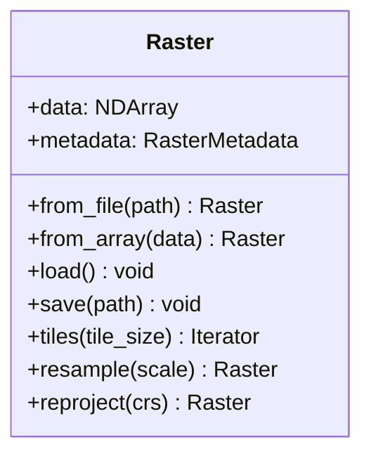

# API Reference

Complete API reference for unbihexium.

## Core Module

| Class | Description |
|-------|-------------|
| `Raster` | Geospatial raster data |
| `Vector` | Geospatial vector data |
| `Tile` | Raster tile for processing |
| `TileGrid` | Grid of tiles |
| `Scene` | Multi-band satellite scene |
| `Pipeline` | Processing pipeline |
| `PipelineRun` | Pipeline execution record |

## Raster Class



## Index Functions

Calculate spectral indices:

$$NDVI = \frac{NIR - RED}{NIR + RED}$$

```python
from unbihexium.core.index import compute_index

ndvi = compute_index("NDVI", bands)
```

## Model Classes

| Class | Description |
|-------|-------------|
| `ModelWrapper` | ML model abstraction |
| `ModelConfig` | Model configuration |
| `ShipDetector` | Ship detection model |
| `BuildingDetector` | Building detection model |
| `WaterDetector` | Water segmentation model |
| `SuperResolution` | Image enhancement model |

## Registry Classes

| Class | Description |
|-------|-------------|
| `CapabilityRegistry` | Track library capabilities |
| `ModelRegistry` | Model management |
| `PipelineRegistry` | Pipeline registration |

## Import Examples

```python
# Core
from unbihexium.core import Raster, Vector, Tile

# Indices
from unbihexium.core.index import compute_index, IndexRegistry

# AI
from unbihexium.ai import ShipDetector, WaterDetector

# Geostatistics
from unbihexium.geostat import Variogram, OrdinaryKriging

# Analysis
from unbihexium.analysis import zonal_statistics, AHP
```
