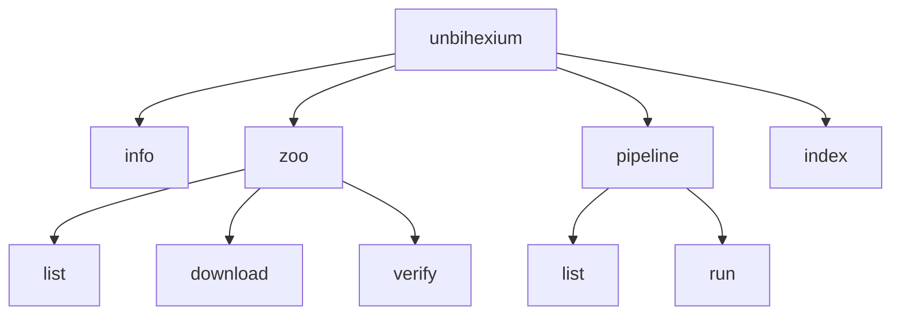

# CLI Reference

Command-line interface reference for unbihexium.

## Global Options

| Option | Description |
|--------|-------------|
| `--version` | Show version |
| `-v, --verbose` | Verbose output |
| `--help` | Show help |

## Commands



## unbihexium info

Display library information.

```bash
unbihexium info
```

## Zoo Commands

### unbihexium zoo list

List available models:

```bash
unbihexium zoo list
unbihexium zoo list --task detection
unbihexium zoo list --json
```

| Option | Description |
|--------|-------------|
| `-t, --task` | Filter by task type |
| `--json` | Output as JSON |

### unbihexium zoo download

Download a model:

```bash
unbihexium zoo download ship_detector_tiny
unbihexium zoo download ship_detector_v1 --version 1.0.0
```

### unbihexium zoo verify

Verify model integrity:

```bash
unbihexium zoo verify ship_detector_tiny
```

Uses SHA256 verification:

$$H = SHA256(model\_file)$$

## Pipeline Commands

### unbihexium pipeline list

```bash
unbihexium pipeline list
unbihexium pipeline list --domain ai
```

### unbihexium pipeline run

```bash
unbihexium pipeline run ship_detection -i input.tif -o output.geojson
```

## Index Command

```bash
unbihexium index NDVI -i input.tif -o output.tif
```

| Option | Description |
|--------|-------------|
| `-i, --input` | Input raster file |
| `-o, --output` | Output file |
| `--red` | Red band name |
| `--nir` | NIR band name |
