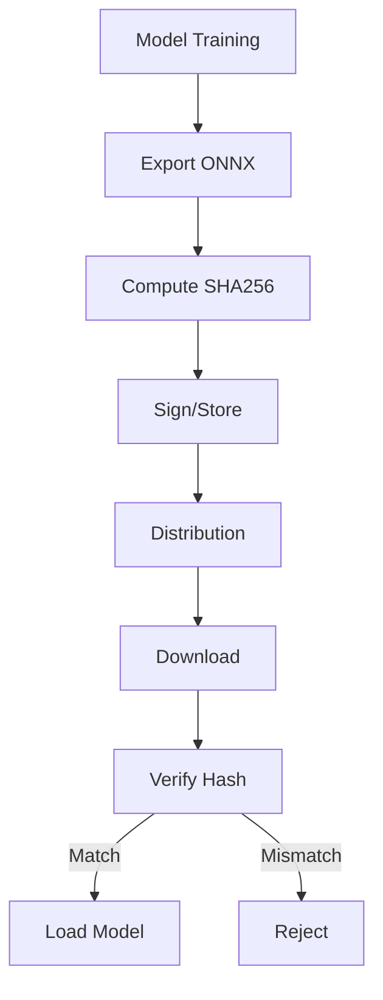

# Model Integrity

## Purpose

Verification of model file integrity and provenance.

## Integrity Chain



## Hash Computation

$$
H(m) = \text{SHA256}(\text{bytes}(m))
$$

| File | Hash File | Verification |
| ------ | ----------- | -------------- |
| model.onnx | model.sha256 | Mandatory |
| config.json | Included in manifest | Recommended |
| labels.json | Included in manifest | Optional |

## Verification API

```python
from unbihexium.zoo import verify_model

# Verify single model
is_valid = verify_model("ship_detector_base")

# Verify with details
result = verify_model("ship_detector_base", detailed=True)
print(result.expected_hash)
print(result.actual_hash)
print(result.verified)
```

## Failure Handling

| Scenario | Action |
| ---------- | -------- |
| Hash mismatch | Delete and re-download |
| Missing hash file | Require re-download |
| Corrupted file | Require re-download |
| Network error | Retry with backoff |

## Model.sha256 Format

```text
a3b2c1d4e5f6789... model.onnx
```

Standard SHA256 checksum file format.
