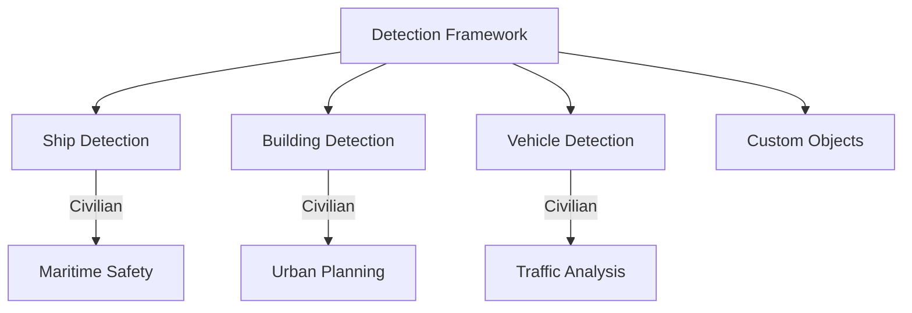

# Responsible Use

Guidelines for responsible use of unbihexium.

## Intended Applications

| Use Case | Status | Notes |
|----------|--------|-------|
| Environmental monitoring | Encouraged | Primary use case |
| Agricultural analysis | Encouraged | Crop and yield analysis |
| Urban planning | Encouraged | Infrastructure assessment |
| Scientific research | Encouraged | Academic applications |
| Disaster response | Encouraged | Humanitarian applications |
| Commercial applications | Allowed | Subject to license |

## Prohibited Uses

- Development of weapons or military systems
- Illegal surveillance
- Human rights violations
- Privacy violations

## Detection Capabilities

## Risk Assessment

For any detection application:

$$Risk = P(misuse) \times Impact$$

Users must conduct their own risk assessments.

## Export Controls

Some capabilities may be subject to export regulations:

| Capability | ECCN | Notes |
|------------|------|-------|
| Core library | EAR99 | Generally unrestricted |
| SAR processing | Review required | Contact for guidance |

## Contact

- Questions: opensource@unbihexium.org
- Security concerns: security@unbihexium.org
