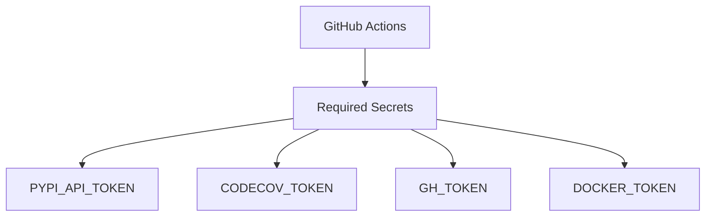

# Secrets and Tokens Management

## Purpose

Documentation of secrets, tokens, and API keys used in CI/CD workflows.

## Token Inventory



## Risk Classification

$$
\text{Exposure Risk} = \text{Scope} \times \text{Permissions} \times \text{Rotation Frequency}^{-1}
$$

| Secret | Required For | Risk | Rotation |
| -------- | ------------- | ------ | ---------- |
| PYPI_API_TOKEN | Package publishing | High | Quarterly |
| CODECOV_TOKEN | Coverage upload | Low | Yearly |
| GH_TOKEN | Releases | Medium | On demand |
| DOCKER_TOKEN | Image push | Medium | Quarterly |

## Secret Details

### PYPI_API_TOKEN

| Property | Value |
| ---------- | ------- |
| Obtain from | <https://pypi.org/manage/account/token/> |
| Scope | unbihexium package only |
| Permissions | Upload |
| CI Usage | `if: secrets.PYPI_API_TOKEN != ''` |

### CODECOV_TOKEN

| Property | Value |
| ---------- | ------- |
| Obtain from | <https://codecov.io/github/unbihexium-oss/unbihexium> |
| Scope | Repository |
| Permissions | Upload |
| CI Usage | Optional |

### GH_TOKEN

| Property | Value |
| ---------- | ------- |
| Obtain from | Auto-provided by GitHub Actions |
| Scope | Repository |
| Permissions | contents: write |
| CI Usage | Automatic |

## Adding Secrets

1. Navigate to repository Settings
2. Select Secrets and Variables > Actions
3. Click "New repository secret"
4. Enter name and value
5. Save

## CI Workflow Guards

All workflows guard against missing secrets:

```yaml
- name: Publish to PyPI
  if: ${{ secrets.PYPI_API_TOKEN != '' }}
  run: twine upload dist/*
```

## Best Practices

1. Never commit secrets to source
2. Use minimal permissions
3. Rotate regularly
4. Audit access logs
