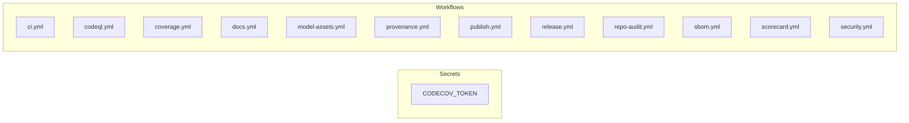

# Secrets Audit Report

## Purpose

This report documents all secrets used in CI/CD workflows.

## Audience

Repository maintainers from trusted organizations.

## Secrets Summary

## Secrets Reference Table

| Secret Name | Used By | Required | Where to Obtain | Permissions | Storage | Notes |
|-------------|---------|----------|-----------------|-------------|---------|-------|
| CODECOV_TOKEN | coverage.yml | No | https://codecov.io/gh/unbihexium-oss/unbihexium/settings | Upload coverage reports | repo | Optional with OIDC; required for private repos |

## Workflow Resilience

All workflows should be resilient to missing secrets:

$$resilience = \frac{guarded\_steps}{total\_secret\_steps}$$

| Workflow | Secrets Used | Has Conditionals |
|----------|--------------|------------------|
| ci.yml | None | No |
| codeql.yml | None | No |
| coverage.yml | CODECOV_TOKEN | No |
| docs.yml | None | No |
| model-assets.yml | None | No |
| provenance.yml | None | No |
| publish.yml | None | No |
| release.yml | None | No |
| repo-audit.yml | None | No |
| sbom.yml | None | No |
| scorecard.yml | None | No |
| security.yml | None | No |

## Recommendations

1. Use OIDC-based authentication where possible (Codecov, PyPI)
2. Guard all secret-dependent steps with conditionals
3. Never fail CI for missing optional secrets

## References

- [Documentation Index](../index.md)
- [Table of Contents](../toc.md)