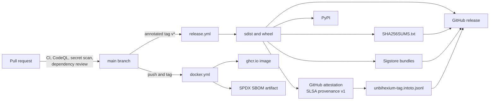

<!--
This Source Code Form is subject to the terms of the Mozilla Public
License, v. 2.0. If a copy of the MPL was not distributed with this
file, You can obtain one at https://mozilla.org/MPL/2.0/.

=============================================================================
Project     : Unbihexium
File        : docs/security/supply_chain_security.md
Title       : Supply Chain Security
Author      : Olaf Yunus Laitinen Imanov <yunus.z.imanov@helsinki.fi>
Affiliation : University of Helsinki
Copyright   : 2025-2026 Unbihexium OSS Foundation and contributors
Licence     : Mozilla Public License 2.0, see LICENSE.txt
Format      : Markdown (CommonMark with GitHub Flavored Markdown extensions)
=============================================================================
-->

# Supply Chain Security

| Field | Value |
| --- | --- |
| Document | UBX-DOC-SEC-SUPPLY-CHAIN |
| Version | 2.0 |
| Status | Active |
| Last reviewed | 2026-09-24 |
| Owner | Unbihexium maintainers (see [MAINTAINERS.md](../../MAINTAINERS.md)) |
| Applies to | Unbihexium 1.0.1 and the main branch, the release workflow and the container image |

## Abstract

This document describes, control by control, how the Unbihexium project protects the path from source code to the artefacts that users install: the Python distributions on PyPI and GitHub, and the container image on the GitHub Container Registry. It covers the pinning of GitHub Actions and CI tools, the hashed lock files, dependency updates and audits, static analysis and fuzzing, licence compliance, the signed and attested release, the container SBOM and scan, and continuous assessment with the OpenSSF Scorecard. Each control names the file that implements it so that auditors can check it, and a separate section states what is not yet in place. The document also gives the commands with which users verify a release. It extends Section 6 and Section 7 of [SECURITY.md](../../SECURITY.md), which remain the normative summary; the machine-readable summary is [security-insights.yml](../../security-insights.yml).

## Contents

- [1. Introduction](#1-introduction)
- [2. Source and Workflow Integrity](#2-source-and-workflow-integrity)
- [3. Dependency Pinning](#3-dependency-pinning)
- [4. Dependency Updates and Vulnerability Checks](#4-dependency-updates-and-vulnerability-checks)
- [5. Static Analysis, Fuzzing and Licence Compliance](#5-static-analysis-fuzzing-and-licence-compliance)
- [6. Release Signing, Provenance and Attestations](#6-release-signing-provenance-and-attestations)
- [7. Container Image](#7-container-image)
- [8. Continuous Assessment](#8-continuous-assessment)
- [9. Verifying a Release](#9-verifying-a-release)
- [10. Known Gaps](#10-known-gaps)
- [References](#references)

## 1. Introduction

### 1.1 Threat Model

The controls address the following supply chain threats, following the categories of the SLSA framework [1]: a compromised or moved third-party GitHub Action; a malicious or vulnerable version of a dependency; a tampered artefact between the build and the user; an artefact built from something other than the tagged source; leaked publishing credentials; and vulnerable packages in the container base image. Threats to the model files are covered in [model_integrity.md](model_integrity.md), and credentials in [secrets_and_tokens.md](secrets_and_tokens.md).

### 1.2 Conventions

The key words MUST, MUST NOT, SHOULD, SHOULD NOT and MAY in this document are to be interpreted as described in RFC 2119 [2] and RFC 8174 [3] when, and only when, they appear in all capitals.

### 1.3 Overview



## 2. Source and Workflow Integrity

### 2.1 Review and Ownership

[.github/CODEOWNERS](../../.github/CODEOWNERS) assigns every file to the maintainer, so every pull request requests a review. Pull request titles follow Conventional Commits ([pr-title.yml](../../.github/workflows/pr-title.yml)), because the title becomes the squash commit message and feeds the release notes. The review process is described in [CONTRIBUTING.md](../../CONTRIBUTING.md). Branch protection rules are repository settings and are not visible in the source tree; the OpenSSF Scorecard reports on them (Section 8).

### 2.2 SHA-Pinned Actions

Every `uses:` reference to a third-party action in [.github/workflows/](../../.github/workflows/) is pinned by a full 40-character commit SHA, with the release tag as a trailing comment, for example:

```yaml
- uses: actions/checkout@d23441a48e516b6c34aea4fa41551a30e30af803  # v6.1.0
```

A tag can be moved by the action's owner or by an attacker who controls the action repository; a commit SHA cannot. Dependabot updates the SHA and the comment together (Section 4.1). The same rule applies to the scanning tools that the workflows download: TruffleHog is pinned by action SHA and by its binary version, and the actionlint release archive in [workflow-lint.yml](../../.github/workflows/workflow-lint.yml) is pinned by version and SHA-256 digest.

### 2.3 Least-Privilege Tokens

Every workflow sets `permissions: contents: read` (the Scorecard workflow `read-all`) and widens permissions per job only where needed. The full table is in [secrets_and_tokens.md](secrets_and_tokens.md), Section 3.

### 2.4 Workflow and Configuration Checks

- actionlint with shellcheck checks every change under `.github/workflows/` ([workflow-lint.yml](../../.github/workflows/workflow-lint.yml)).
- CodeQL analyses the workflows as the `actions` language, which finds script injection through untrusted event data and excessive permissions ([codeql.yml](../../.github/workflows/codeql.yml)).
- [repo-config.yml](../../.github/workflows/repo-config.yml) validates the workflows, Dependabot configuration, issue forms, `CITATION.cff`, the Compose file and the Codecov configuration against their JSON Schemas, runs yamllint, and validates [security-insights.yml](../../security-insights.yml) against the OpenSSF Security Insights schema 2.2.0.
- TruffleHog scans new commits for verified live credentials ([secret-scan.yml](../../.github/workflows/secret-scan.yml)).

## 3. Dependency Pinning

### 3.1 Declared Ranges and Lock Files

[pyproject.toml](../../pyproject.toml) declares dependencies with lower bounds only, as described in [VERSIONING.md](../../VERSIONING.md), Section 8. Reproducible environments come from lock files compiled with uv [4] by `make lock`, each listing exact versions and the SHA-256 hash of every permitted file:

| Lock file | Content | Consumers |
| --- | --- | --- |
| [requirements.txt](../../requirements.txt) | Runtime with the `onnx` and `serving` extras | Container image, pip-audit, licence check, type check |
| [requirements-dev.txt](../../requirements-dev.txt) | All extras, for development | `make install-dev` |
| [.github/requirements/requirements-ci-test.txt](../../.github/requirements/requirements-ci-test.txt) | Test environment, including the dependencies of PyTorch | CI, Coverage, Integration, Model Zoo |
| [.github/requirements/requirements-ci-tools.txt](../../.github/requirements/requirements-ci-tools.txt) | ruff, pyright, bandit, pip-audit, build, twine, reuse, pip-licenses, check-jsonschema, yamllint, uv and their dependencies | Lint, security, release, packaging and configuration jobs |
| [.github/requirements/requirements-ci-fuzz.txt](../../.github/requirements/requirements-ci-fuzz.txt) | atheris and NumPy | Fuzzing |
| [.github/requirements/requirements-ci-torch.txt](../../.github/requirements/requirements-ci-torch.txt) | CPU build of PyTorch only | CI, Coverage, Integration, Model Zoo |

`make lock-check` compares the committed files with a fresh compilation.

### 3.2 Hash-Checked Installation

Every workflow installs from these files with `pip install --require-hashes`, so pip refuses any file whose hash is not listed, and any package that is not listed at all [5]. The package itself is then installed with `pip install --no-deps -e .`, so no dependency is resolved outside the lock.

### 3.3 The PyTorch Lock

The CPU wheels of PyTorch come from the PyTorch index (`https://download.pytorch.org/whl/cpu`), which is not reachable from every environment that runs `make lock`. [torch-lock.yml](../../.github/workflows/torch-lock.yml) therefore compiles `requirements-ci-torch.txt` from `requirements-ci-torch.in` with `uv pip compile --universal --no-deps --generate-hashes` on GitHub's runners. It runs on demand, weekly on Thursday at 05:00 UTC and when the input, the lock or the workflow changes; it prints the compiled file, uploads it as the artifact `requirements-ci-torch` and fails when it differs from the committed file, so that a new PyTorch release becomes visible. The maintainer copies the printed file into the repository. Workflows install it with `--require-hashes --no-deps`; the dependencies of PyTorch come from the hashed test lock.

## 4. Dependency Updates and Vulnerability Checks

### 4.1 Dependabot

[.github/dependabot.yml](../../.github/dependabot.yml) configures three update streams:

| Ecosystem | Directory | Schedule | Notes |
| --- | --- | --- | --- |
| pip | `/` | weekly | Grouped into one pull request; at most 5 open; major updates of `torch` are ignored |
| github-actions | `/` | weekly | Updates the pinned SHAs and their version comments |
| docker | `/` | monthly | Updates the tag and digest of the base image in the Dockerfile |

The pip stream covers the manifests in the repository root. The hashed CI locks under `.github/requirements/` are refreshed with `make lock` and the Torch Lock workflow, not by Dependabot.

### 4.2 Dependency Review

On every pull request, `actions/dependency-review-action` compares the dependency manifests of the base and the head ([security.yml](../../.github/workflows/security.yml), job `dependency-review`). With [.github/dependency-review-config.yml](../../.github/dependency-review-config.yml) it fails the pull request when a new or updated dependency has a known vulnerability of high or critical severity (runtime and development scopes) or a denied licence: the AGPL and GPL families, SSPL-1.0, BUSL-1.1 and the non-commercial Creative Commons licences.

### 4.3 pip-audit

The job `pip-audit` in [security.yml](../../.github/workflows/security.yml) runs on pushes to `main`, on pull requests and weekly (Sunday 00:00 UTC):

```bash
pip-audit --require-hashes --disable-pip -r requirements.txt
```

It queries the PyPI advisory database for the exact locked versions. Its result is informational: the step ends with `|| echo "Audit completed"`, so findings appear in the job log but do not fail the build. The command was run on 2026-09-24 against the committed `requirements.txt` and reported `No known vulnerabilities found`. How findings are handled is described in [vulnerability_management.md](vulnerability_management.md).

### 4.4 Container Scan

Grype scans the built image; see Section 7.3.

## 5. Static Analysis, Fuzzing and Licence Compliance

### 5.1 CodeQL

[codeql.yml](../../.github/workflows/codeql.yml) runs GitHub CodeQL [6] with the `security-extended` query suite for `python` (package, tests, scripts and examples) and `actions` (workflows), without a build step, on pull requests and pushes to `main`, weekly on Tuesday at 03:00 UTC and on demand. Results appear under Security, Code scanning, one category per language. This is the advanced setup; the default CodeQL setup of the repository must stay disabled, because GitHub rejects advanced uploads while it is enabled.

### 5.2 Bandit

The job `bandit` in [security.yml](../../.github/workflows/security.yml) runs `bandit -c pyproject.toml -r src/` with the settings in `pyproject.toml`. Like pip-audit it is informational. The same Bandit release runs as a pre-commit hook.

### 5.3 Fuzzing

[fuzz.yml](../../.github/workflows/fuzz.yml) runs coverage-guided fuzzing with atheris [7] against the parsers that read untrusted input: GeoJSON validation, bounds and orientation ([fuzz/fuzz_geojson.py](../../fuzz/fuzz_geojson.py)) and STAC item and time parsing ([fuzz/fuzz_stac.py](../../fuzz/fuzz_stac.py)). Each target starts from its seed corpus in [fuzz/corpus/](../../fuzz/corpus/) and runs for two minutes when the parsers, targets or workflow change, and for twenty minutes weekly (Wednesday 02:00 UTC) and on demand. A crash fails the job and uploads the crashing input; fixed crashes are added to the corpus as `regression_<name>` and replayed by `tests/unit/test_fuzz_targets.py`.

### 5.4 Licence Compliance and REUSE

[license-compliance.yml](../../.github/workflows/license-compliance.yml) checks that every source file carries the MPL-2.0 notice, runs `reuse lint` against [REUSE.toml](../../REUSE.toml) so that every file has machine-readable copyright and licence information (REUSE Specification 3.3 [8]), and checks the licences of the installed runtime dependencies with pip-licenses and `.github/scripts/check_dependency_licenses.py`, rejecting strong copyleft and source-available licences. It runs on pushes, pull requests, weekly and on demand. Licence obligations are described in [COMPLIANCE.md](../../COMPLIANCE.md).

## 6. Release Signing, Provenance and Attestations

### 6.1 Build

Releases are built only by [.github/workflows/release.yml](../../.github/workflows/release.yml), on GitHub-hosted runners, when a tag matching `v*` is pushed. The job installs `build` from the hashed tools lock and runs `python -m build`, which produces the sdist and the wheel in `dist/`. The procedure for maintainers is in [docs/operations/releasing.md](../operations/releasing.md).

### 6.2 Outputs

| Output | Produced by | Where |
| --- | --- | --- |
| `unbihexium-<version>.tar.gz`, `unbihexium-<version>-py3-none-any.whl` | `python -m build` | GitHub release and PyPI |
| `SHA256SUMS.txt` | `sha256sum` over `dist/` | GitHub release |
| GitHub artifact attestation, SLSA build provenance v1 [9] | `actions/attest-build-provenance` | GitHub attestations API of the repository |
| `<file>.sigstore.json`, one per distribution | `sigstore/gh-action-sigstore-python`, keyless [10] | GitHub release |
| `unbihexium-<tag>.intoto.jsonl` | the DSSE envelope of the attestation bundle, exported with `jq` | GitHub release |

The Sigstore signatures and the attestation are bound to the workflow identity `https://github.com/unbihexium-oss/unbihexium/.github/workflows/release.yml@refs/tags/<tag>` through the OIDC token of the job (see [secrets_and_tokens.md](secrets_and_tokens.md), Section 4), and are recorded in the public Rekor transparency log. The `.intoto.jsonl` file contains the signed in-toto statement [11] with the SHA-256 digests of the distributions as subjects and the SLSA provenance predicate (builder, workflow, commit) for archival and inspection; the attestation itself is verified with the GitHub CLI (Section 9.3).

### 6.3 Publication

The workflow creates the GitHub release with the assets above and release notes generated from the merged pull requests (categories in [.github/release.yml](../../.github/release.yml)), then uploads the distributions to PyPI with `pypa/gh-action-pypi-publish` and the `PYPI_API_TOKEN` repository secret.

### 6.4 Releases Without Signatures

The signing, attestation and provenance steps were added after the 1.0.1 release. The releases v1.0.0 and v1.0.1 carry only the distributions and `SHA256SUMS.txt` as release assets, with no `.sigstore.json` bundles and no `.intoto.jsonl` file. Moreover, the files attached to the v1.0.1 GitHub release are not byte-identical to the files on PyPI, so the GitHub checksums do not match the PyPI files:

| File | SHA-256 in the v1.0.1 `SHA256SUMS.txt` | SHA-256 on PyPI |
| --- | --- | --- |
| `unbihexium-1.0.1-py3-none-any.whl` | `08a2d2de...2228ca7` | `751f4e43...934ffa1` |
| `unbihexium-1.0.1.tar.gz` | `446a879d...ddc1cfd` | `2e0723bc...c5a857b` |

Users of 1.0.x MUST verify PyPI downloads against the digests that PyPI publishes (Section 9.1), not against the GitHub checksum file. Every release built by the current workflow carries the full set of signed artefacts.

## 7. Container Image

### 7.1 Build

The image is built from the [Dockerfile](../../Dockerfile) in the repository root, with the base image pinned by digest and the runtime dependencies installed from the hashed [requirements.txt](../../requirements.txt). The build, the runtime user and the deployment options are described in [docs/operations/docker.md](../operations/docker.md).

### 7.2 Publication and SBOM

[docker.yml](../../.github/workflows/docker.yml) builds the image on pull requests (without pushing) and pushes it to `ghcr.io/unbihexium-oss/unbihexium` on pushes to `main` and on version tags. For every pushed image, `anchore/sbom-action` (Syft) generates an SPDX [12] software bill of materials of the image by digest and stores it as the workflow artifact `sbom-docker.spdx.json`. The SBOM is kept with the workflow run under GitHub's artifact retention; it is not attached to the image or to the release.

### 7.3 Vulnerability Scan

[container-scan.yml](../../.github/workflows/container-scan.yml) builds the image locally and scans it with Grype [13] when the Dockerfile, `.dockerignore`, `pyproject.toml` or a `requirements*.txt` file changes on `main` or in a pull request, weekly on Monday at 03:00 UTC and on demand. The job fails on critical vulnerabilities that have a released fix (`severity-cutoff: critical`, `only-fixed: true`) and uploads its SARIF report to code scanning under the category `grype-container`, except for pull requests from forks.

## 8. Continuous Assessment

[scorecard.yml](../../.github/workflows/scorecard.yml) runs the OpenSSF Scorecard [14] on pushes to `main`, weekly on Monday at 06:00 UTC and when a branch protection rule changes. It publishes the results to the public Scorecard API, which feeds the badge in [README.md](../../README.md), and uploads them as SARIF to code scanning. Scorecard checks, among others, branch protection, pinned dependencies, token permissions, signed releases, SAST, fuzzing and the presence of a security policy. No formal external security audit of Unbihexium has been performed.

## 9. Verifying a Release

### 9.1 Packages From PyPI

Every file on PyPI has a SHA-256 digest published by PyPI. A hash-pinned requirement makes pip refuse any other file:

```bash
echo 'unbihexium==1.0.1 --hash=sha256:751f4e4397fac71930fa81f9de408a3cbed17d643605494591c427e55934ffa1' > pin.txt
python -m pip download --no-deps --require-hashes -r pin.txt -d downloads
```

The digest above is that of `unbihexium-1.0.1-py3-none-any.whl` as published by PyPI, checked on 2026-09-24 with `pip hash`. For another version or file, take the digest from the file list of <https://pypi.org/project/unbihexium/>.

### 9.2 Checksums From the GitHub Release

For releases built by the current workflow, download the distributions and `SHA256SUMS.txt` from the GitHub release into one directory and run:

```bash
sha256sum --check --ignore-missing SHA256SUMS.txt
```

Each file listed and present is reported as `OK`. A checksum file downloaded from the same place as the files only protects against corruption; Sections 9.3 and 9.4 establish where the files came from.

### 9.3 Sigstore Signatures

With the `.sigstore.json` bundle next to the file, install the Sigstore client (`python -m pip install sigstore`) and run, replacing `<tag>` (for example `v1.0.2`) and `<file>`:

```bash
python -m sigstore verify github \
  --cert-identity https://github.com/unbihexium-oss/unbihexium/.github/workflows/release.yml@refs/tags/<tag> \
  <file>
```

The command succeeds only if the signature is valid, is recorded in the transparency log and was made by the release workflow of this repository at that tag. The options `--repository unbihexium-oss/unbihexium` and `--ref refs/tags/<tag>` MAY be added to check the corresponding certificate extensions as well.

### 9.4 Attestations and SLSA Provenance

With the GitHub CLI:

```bash
gh attestation verify <file> --repo unbihexium-oss/unbihexium
```

The command fetches the attestations for the file's digest from GitHub, verifies their Sigstore signatures and checks that they were issued for this repository; it fails when no valid attestation exists. This works for the PyPI files as well as for the GitHub release assets of the same release, since both come from the same build.

### 9.5 Status of These Commands

At the date of review no release has yet been built by the current workflow, so the commands in Sections 9.3 and 9.4 have not been exercised against a real Unbihexium release; the options of the Sigstore command were checked against sigstore 4.5.0, and the GitHub CLI command follows the GitHub documentation [15]. The commands in Sections 9.1 and 9.2 were run as shown, the latter against distributions built locally with `python -m build`.

## 10. Known Gaps

The following controls are not in place at the date of review. They are listed so that users can take them into account and so that progress can be tracked in [ROADMAP.md](../../ROADMAP.md).

- **Unsigned 1.0.x releases.** v1.0.0 and v1.0.1 have no signatures or provenance, and the v1.0.1 GitHub checksums do not match PyPI (Section 6.4). The first signed release is planned in [ROADMAP.md](../../ROADMAP.md).
- **Long-lived PyPI token.** Uploads use `PYPI_API_TOKEN`; PyPI trusted publishing is under consideration.
- **No check that the tag matches the version.** The distribution version is the static version in `pyproject.toml`; release.yml does not compare it with the tag.
- **Unpinned build backend.** `python -m build` in release.yml and package.yml builds in an isolated environment that installs the build backend `hatchling>=1.27.0` from PyPI without a hash. The frontend `build` is hash-pinned; the backend is not.
- **Some CI tools pinned by version only.** markdownlint-cli (through `npx`), the cue binary and the Security Insights schema in repo-config.yml, and the pre-commit hooks (by tag) are pinned by version, not by digest.
- **Informational audits.** pip-audit, Bandit and pyright never fail a build; findings require a human to read the logs.
- **Container image.** The image is not signed and has no attestation; its SBOM is only a workflow artifact.
- **No SBOM for the Python distributions.**
- **Package smoke test.** package.yml installs the built wheel with ordinary dependency resolution, deliberately like a user would, so that job is not hash-pinned.
- **No external audit.**

## References

[1] OpenSSF. Supply-chain Levels for Software Artifacts (SLSA) Specification v1.0: Threats and mitigations. 2023. <https://slsa.dev/spec/v1.0/threats>

[2] Bradner, S. Key words for use in RFCs to Indicate Requirement Levels. RFC 2119. 1997. <https://www.rfc-editor.org/rfc/rfc2119>

[3] Leiba, B. Ambiguity of Uppercase vs Lowercase in RFC 2119 Key Words. RFC 8174. 2017. <https://www.rfc-editor.org/rfc/rfc8174>

[4] Astral. uv documentation. 2026. <https://docs.astral.sh/uv/>

[5] Python Packaging Authority. pip documentation: Secure installs (hash-checking mode). 2026. <https://pip.pypa.io/en/stable/topics/secure-installs/>

[6] GitHub. About code scanning with CodeQL. 2026. <https://docs.github.com/en/code-security/code-scanning/introduction-to-code-scanning/about-code-scanning-with-codeql>

[7] Google. Atheris: A Coverage-Guided, Native Python Fuzzer. 2026. <https://github.com/google/atheris>

[8] Free Software Foundation Europe. REUSE Specification, version 3.3. 2024. <https://reuse.software/spec-3.3/>

[9] OpenSSF. SLSA Specification v1.0: Build Provenance. 2023. <https://slsa.dev/spec/v1.0/provenance>

[10] Sigstore. Sigstore documentation. 2026. <https://docs.sigstore.dev/>

[11] in-toto contributors. in-toto Attestation Framework. 2026. <https://github.com/in-toto/attestation>

[12] The Linux Foundation. The Software Package Data Exchange (SPDX) Specification. 2026. <https://spdx.dev/>

[13] Anchore. Grype: A vulnerability scanner for container images and filesystems. 2026. <https://github.com/anchore/grype>

[14] OpenSSF. OpenSSF Scorecard. 2026. <https://scorecard.dev/>

[15] GitHub. Using artifact attestations to establish provenance for builds. 2026. <https://docs.github.com/en/actions/security-for-github-actions/using-artifact-attestations/using-artifact-attestations-to-establish-provenance-for-builds>

<!--
=============================================================================
End of file docs/security/supply_chain_security.md
Part of Unbihexium (https://github.com/unbihexium-oss/unbihexium).
Cite the project as described in CITATION.cff.
=============================================================================
-->
