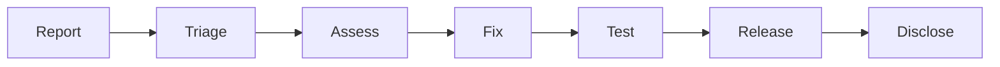

# Vulnerability Management

## Purpose

Procedures for handling security vulnerabilities.

## Response Process

## Severity Classification

$$
\text{CVSS Score} = \text{Base} + \text{Temporal} + \text{Environmental}
$$

| Severity | CVSS | Response SLA | Disclosure |
| ---------- | ------ | -------------- | ------------ |
| Critical | 9.0+ | 24 hours | After patch |
| High | 7.0-8.9 | 7 days | After patch |
| Medium | 4.0-6.9 | 30 days | After patch |
| Low | 0.1-3.9 | 90 days | Quarterly |

## Reporting

Report vulnerabilities to: <security@unbihexium.dev>

Include:

1. Description of vulnerability
2. Steps to reproduce
3. Impact assessment
4. Suggested fix (optional)

## Timeline

| Phase | Duration |
| ------- | ---------- |
| Acknowledgment | 48 hours |
| Initial assessment | 72 hours |
| Fix development | Varies |
| Patch release | Per SLA |
| Public disclosure | 90 days max |
