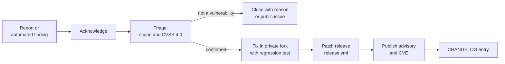

<!--
This Source Code Form is subject to the terms of the Mozilla Public
License, v. 2.0. If a copy of the MPL was not distributed with this
file, You can obtain one at https://mozilla.org/MPL/2.0/.

=============================================================================
Project     : Unbihexium
File        : docs/security/vulnerability_management.md
Title       : Vulnerability Management
Author      : Olaf Yunus Laitinen Imanov <yunus.z.imanov@helsinki.fi>
Affiliation : University of Helsinki
Copyright   : 2025-2026 Unbihexium OSS Foundation and contributors
Licence     : Mozilla Public License 2.0, see LICENSE.txt
Format      : Markdown (CommonMark with GitHub Flavored Markdown extensions)
=============================================================================
-->

# Vulnerability Management

| Field | Value |
| --- | --- |
| Document | UBX-DOC-803 |
| Version | 2.0 |
| Status | Active |
| Last reviewed | 2026-09-24 |
| Owner | Unbihexium maintainers (see [MAINTAINERS.md](../../MAINTAINERS.md)) |
| Applies to | Unbihexium 1.0.x and the main branch |

## Abstract

This document describes how vulnerabilities in Unbihexium and in its dependencies are found, received, assessed, fixed and disclosed. It is the operational companion of [SECURITY.md](../../SECURITY.md), which is the normative policy: the reporting channels, the supported versions, the timelines and the disclosure rules are defined there and are only summarised here. In addition, this document explains how the automated checks in continuous integration surface vulnerable dependencies and code weaknesses, who acts on their findings and how, and what users can do to track vulnerabilities in their own installations. It is intended for reporters, maintainers, downstream packagers and auditors.

## Contents

- [1. Introduction](#1-introduction)
- [2. Sources of Vulnerability Information](#2-sources-of-vulnerability-information)
- [3. Intake of Reports](#3-intake-of-reports)
- [4. Triage and Severity](#4-triage-and-severity)
- [5. Fixing and Releasing](#5-fixing-and-releasing)
- [6. Advisories and Disclosure](#6-advisories-and-disclosure)
- [7. Vulnerabilities in Dependencies](#7-vulnerabilities-in-dependencies)
- [8. Guidance for Users](#8-guidance-for-users)
- [References](#references)

## 1. Introduction

### 1.1 Purpose and Scope

The process covers the components listed as in scope in Section 4 of [SECURITY.md](../../SECURITY.md): the Python package, the command line interface, the REST service, the model zoo loader and its digests, the container image, the deployment manifests and the GitHub Actions workflows. The quality of predictions of the untrained starter models is not a vulnerability; the 520 models of the zoo are untrained starter models with deterministic weights, except the 28 models of the 7 spectral index families, which compute exact formulas.

### 1.2 Conventions

The key words MUST, MUST NOT, SHOULD, SHOULD NOT and MAY in this document are to be interpreted as described in RFC 2119 [1] and RFC 8174 [2] when, and only when, they appear in all capitals.

### 1.3 Roles

The project has a single maintainer, Olaf Yunus Laitinen Imanov (University of Helsinki), who receives and handles every report and every automated finding. There is no security team, on-call rotation or bug bounty. All timelines are best-effort targets, as stated in [SECURITY.md](../../SECURITY.md).

### 1.4 Life Cycle

```mermaid
flowchart LR
    A[Report or<br/>automated finding] --> B[Acknowledge]
    B --> C[Triage:<br/>scope and CVSS 4.0]
    C -->|not a vulnerability| D[Close with reason<br/>or public issue]
    C -->|confirmed| E[Fix in private fork<br/>with regression test]
    E --> F[Patch release<br/>release.yml]
    F --> G[Publish advisory<br/>and CVE]
    G --> H[CHANGELOG entry]
```

## 2. Sources of Vulnerability Information

| Source | What it finds | Where findings appear | Blocking |
| --- | --- | --- | --- |
| Private reports (Section 3) | Any vulnerability | Draft GitHub security advisory or e-mail | Not applicable |
| CodeQL, `security-extended`, Python and Actions ([codeql.yml](../../.github/workflows/codeql.yml)) | Injection, unsafe deserialisation, path traversal, workflow script injection, excessive permissions | Security, Code scanning | Alerts are shown on the pull request; enforcement depends on repository rules |
| Bandit ([security.yml](../../.github/workflows/security.yml)) | Common Python security anti-patterns in `src/` | Failed job, findings in the job log | Yes, the job fails |
| Fuzzing with atheris ([fuzz.yml](../../.github/workflows/fuzz.yml)) | Crashes and uncaught exceptions in the GeoJSON and STAC parsers | Failed job, crashing input as artifact | Yes, the job fails |
| Dependency Review ([security.yml](../../.github/workflows/security.yml)) | New dependencies with high or critical advisories, denied licences | Pull request check | Yes |
| pip-audit ([security.yml](../../.github/workflows/security.yml)) | Known vulnerabilities in the locked dependencies of `requirements.txt` and `requirements-dev.txt` | Failed job, findings in the job log | Yes, the job fails |
| Grype ([container-scan.yml](../../.github/workflows/container-scan.yml)) | Known vulnerabilities in the operating system packages and Python packages of the image | Security, Code scanning, category `grype-container` | Yes for critical findings with a released fix |
| TruffleHog ([secret-scan.yml](../../.github/workflows/secret-scan.yml)) | Verified live credentials in new commits | Failed job | Yes |
| Dependabot ([.github/dependabot.yml](../../.github/dependabot.yml)) | Outdated pip packages, actions and base image | Pull requests | Not applicable |
| OpenSSF Scorecard ([scorecard.yml](../../.github/workflows/scorecard.yml)) | Weak repository practices | Security, Code scanning; public Scorecard API | No |

Details of each control are in [supply_chain_security.md](supply_chain_security.md).

## 3. Intake of Reports

Suspected vulnerabilities MUST be reported privately, never in a public issue, pull request or discussion:

1. preferably through GitHub private vulnerability reporting at <https://github.com/unbihexium-oss/unbihexium/security/advisories/new>;
2. alternatively by e-mail to <yunus.z.imanov@helsinki.fi> with a subject that starts with `[SECURITY] unbihexium`.

The content a report should contain, the good-faith research statement and the reasons for preferring the advisory form are given in Section 3 of [SECURITY.md](../../SECURITY.md). The issue chooser links to the private form, and blank public issues are disabled. If a vulnerability is reported publicly by mistake, the maintainer copies the details into a draft advisory and asks the reporter to remove them from the public place; the issue is then handled like any private report.

Findings of the automated tools in Section 2 are internal intake: the maintainer reviews code scanning alerts, failed security jobs and the logs of the informational jobs, in particular after the weekly scheduled runs.

## 4. Triage and Severity

### 4.1 Steps

For each report or finding the maintainer:

1. acknowledges receipt, targeted within 7 calendar days;
2. reproduces the issue on the main branch and on the latest release, using synthetic data;
3. decides whether it is in scope (Section 4 of [SECURITY.md](../../SECURITY.md)) and whether it is exploitable in a realistic deployment of the affected component;
4. assigns a provisional severity, targeted within 21 calendar days of the report.

A finding that is not a vulnerability (for example a Bandit warning on a safe construct, or a dependency advisory for a code path that Unbihexium does not use) is closed with the reason recorded; code scanning alerts are dismissed with the matching reason. Non-security defects found during triage are moved to a public issue with the reporter's agreement.

### 4.2 Severity

Severity is assessed with the base metrics of CVSS 4.0 [3] for the usual deployment of the affected component, and reported with the qualitative ratings none, low, medium, high and critical. Typical deployments considered are:

| Component | Assumed attacker position |
| --- | --- |
| REST service (`unbihexium.serving`) | Network client, with or without the API key depending on configuration |
| Library readers (GeoTIFF, GeoJSON, STAC, Zarr, Parquet) | Supplier of an input file or STAC document |
| Model loader | Supplier of a checkpoint or ONNX file, or of a registered download URL |
| Workflows | Author of a pull request from a fork |
| Container image | Network client of the service; tenant of the same host |

The score guides prioritisation and is not a statement about the risk of a particular deployment.

## 5. Fixing and Releasing

### 5.1 Development of the Fix

Fixes for undisclosed vulnerabilities are developed in the temporary private fork that GitHub creates for the advisory, so that the fix is not visible before the release. The reporter is invited to review it. Every fix MUST include a regression test; a crash found by fuzzing is additionally added to [fuzz/corpus/](../../fuzz/corpus/) as `regression_<name>`, where `tests/unit/test_fuzz_targets.py` replays it on every test run.

### 5.2 Release

Fixes are merged into `main` and released as a new patch version of the latest release series; earlier patch versions are not patched separately ([VERSIONING.md](../../VERSIONING.md), Section 10). The release follows [docs/operations/releasing.md](../operations/releasing.md) and is built by [.github/workflows/release.yml](../../.github/workflows/release.yml). A security fix MAY remove or restrict a feature without a deprecation period when no safe alternative exists; the changelog then explains why ([VERSIONING.md](../../VERSIONING.md), Section 5).

### 5.3 Targets

| Severity | Target for the fixed release |
| --- | --- |
| Critical, high | Within 30 days of confirmation |
| Medium, low | Within 90 days of confirmation, or with the next regular release |

When a vulnerability is already exploited or public, a fix or documented mitigation is prioritised and the advisory may be published before a fix exists. When a target cannot be met, the maintainer tells the reporter why and agrees a new date. The complete timeline table is in Section 5.2 of [SECURITY.md](../../SECURITY.md).

## 6. Advisories and Disclosure

A confirmed vulnerability in a released version is disclosed by publishing the GitHub security advisory at <https://github.com/unbihexium-oss/unbihexium/security/advisories> when the fix is released, and no later than 90 days after the report unless reporter and maintainer agree otherwise. The advisory states the affected and fixed versions (as PEP 440 ranges of the `unbihexium` package on PyPI), the severity and CVSS vector, the credit and, where assigned, a CVE identifier. GitHub is a CVE Numbering Authority, and the maintainer requests a CVE through the advisory for every confirmed vulnerability that affects a released version [4]. Published advisories flow into the GitHub Advisory Database, from which pip-audit and Dependabot inform users. The fix is also recorded in the Security section of [CHANGELOG.md](../../CHANGELOG.md), and the release notes list it under the Security category when the pull request carries the `security` label ([.github/release.yml](../../.github/release.yml)).

Reporters are credited under the name or handle they choose, or remain anonymous on request. The process follows the principles of ISO/IEC 29147 [5] and ISO/IEC 30111 [6], scaled to a single-maintainer project.

## 7. Vulnerabilities in Dependencies

### 7.1 Policy

A publicly known vulnerability in a third-party dependency is reported to that project, not to Unbihexium. It becomes an Unbihexium issue when the way Unbihexium uses the dependency makes it exploitable, or when the locked versions shipped in the container image or the lock files are affected.

### 7.2 How CI Surfaces Them

- **At pull request time**, Dependency Review blocks the introduction of a dependency version with a high or critical advisory.
- **Continuously**, pip-audit checks the exact versions of `requirements.txt` on every push to `main`, every pull request and weekly (Sunday 00:00 UTC), and Grype scans the container image weekly (Monday 03:00 UTC) and on relevant changes. pip-audit only writes to the job log; Grype fails on critical findings with an available fix and records all findings in code scanning.
- **By updates**, Dependabot proposes weekly updates of the pip dependencies and actions and monthly updates of the base image. The hashed CI locks under `.github/requirements/` are refreshed with `make lock`; the PyTorch lock is checked weekly by [torch-lock.yml](../../.github/workflows/torch-lock.yml).

At the date of review, `pip-audit --require-hashes --disable-pip -r requirements.txt` reported `No known vulnerabilities found` for the committed runtime lock.

### 7.3 Response

When a dependency advisory affects Unbihexium, the maintainer:

1. updates the lock files (`make lock`, or the Dependabot pull request) so that the container image and CI use a fixed version;
2. raises the lower bound in `pyproject.toml` when the vulnerable version must be excluded for all users; this is a PATCH change under [VERSIONING.md](../../VERSIONING.md), Section 8;
3. publishes a patch release when the lower bound or the image changed, and an advisory when Unbihexium itself was exploitable;
4. for the container base image, accepts the Dependabot update of the pinned digest or updates it manually.

Because `pyproject.toml` sets no upper bounds, users who install from PyPI without the lock file normally receive fixed dependency versions as soon as they upgrade the dependency, without waiting for an Unbihexium release.

## 8. Guidance for Users

- Use the latest 1.0.x release; only the latest series receives fixes.
- Watch the repository's security advisories (GitHub, Watch, Custom, Security alerts) or rely on Dependabot and pip-audit in your own projects, which read the GitHub Advisory Database.
- Audit your own environment regularly, for example with `pip-audit` in the environment where Unbihexium is installed, or with `pip-audit -r requirements.txt` for a lock file.
- Rebuild or pull the container image regularly to receive base image fixes, and pin it by release tag or digest.
- Apply the operating recommendations for the REST service in Section 8 of [SECURITY.md](../../SECURITY.md).

## References

[1] Bradner, S. Key words for use in RFCs to Indicate Requirement Levels. RFC 2119. 1997. <https://www.rfc-editor.org/rfc/rfc2119>

[2] Leiba, B. Ambiguity of Uppercase vs Lowercase in RFC 2119 Key Words. RFC 8174. 2017. <https://www.rfc-editor.org/rfc/rfc8174>

[3] FIRST. Common Vulnerability Scoring System version 4.0: Specification Document. 2023. <https://www.first.org/cvss/v4.0/specification-document>

[4] GitHub. About repository security advisories. 2026. <https://docs.github.com/en/code-security/security-advisories/working-with-repository-security-advisories/about-repository-security-advisories>

[5] ISO/IEC. ISO/IEC 29147:2018 Information technology, Security techniques, Vulnerability disclosure. 2018. <https://www.iso.org/standard/72311.html>

[6] ISO/IEC. ISO/IEC 30111:2019 Information technology, Security techniques, Vulnerability handling processes. 2019. <https://www.iso.org/standard/69725.html>

<!--
=============================================================================
End of file docs/security/vulnerability_management.md
Part of Unbihexium (https://github.com/unbihexium-oss/unbihexium).
Cite the project as described in CITATION.cff.
=============================================================================
-->
