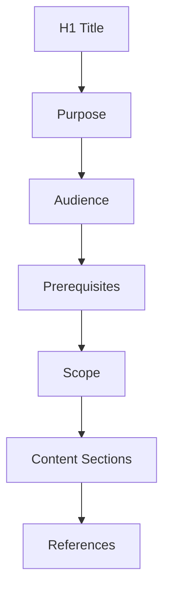
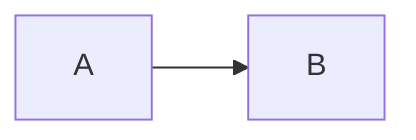

# Documentation Style Guide

## Purpose

This document defines the standards for all documentation in the unbihexium repository.

## Audience

Technical writers, contributors, and maintainers.

## Prerequisites

Familiarity with Markdown, Mermaid diagrams, and LaTeX math notation.

## Information Architecture

Every documentation page must follow this structure:

| Section | Required | Description |
|---------|----------|-------------|
| Title (H1) | Yes | Single H1 at top |
| Purpose | Yes | What this document covers |
| Audience | Yes | Who should read this |
| Prerequisites | Conditional | Required knowledge |
| Scope | Conditional | What is covered |
| Non-goals | Conditional | What is not covered |
| Content | Yes | Main content |
| References | Conditional | Links to related docs |

## Document Structure



## Writing Rules

1. **Short paragraphs**: Maximum 4-5 sentences per paragraph
2. **Defined terms**: Define technical terms on first use
3. **Consistent terminology**: Use the same term for the same concept
4. **Explicit assumptions**: State all assumptions clearly
5. **No emoji**: Never use emoji characters anywhere
6. **No slang**: Use formal, professional language

## Formatting Rules

### Tables

All tables must use GitHub-flavored Markdown:

```markdown
| Header 1 | Header 2 |
|----------|----------|
| Cell 1   | Cell 2   |
```

### Diagrams

All diagrams must use Mermaid in fenced code blocks:

````markdown

````

### Mathematics

Use LaTeX syntax for mathematical expressions:

- Inline: `$E = mc^2$` renders as $E = mc^2$
- Block: `$$\int_0^\infty e^{-x} dx = 1$$`

## Legal and Security Rules

Policy documents must include:

- "This document does not constitute legal advice" disclaimer
- Responsible use guidance where applicable
- Clear scope limitations

## Cross-Linking Rules

Every page should link to:

1. [Documentation Index](index.md)
2. [Table of Contents](toc.md)

## Quality Gate Formula

Documentation quality score:

$$Q = \frac{M + L + T}{3} \times C$$

Where:
- $M$ = Mermaid diagram present (0 or 1)
- $L$ = LaTeX formula present (0 or 1)
- $T$ = Table present (0 or 1)
- $C$ = Cross-link compliance (0 to 1)

## References

- [Documentation Index](index.md)
- [Table of Contents](toc.md)
- [Glossary](glossary.md)
