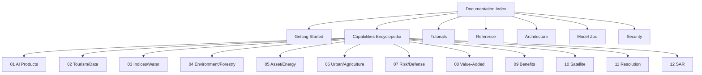

# Table of Contents

## Purpose

Complete navigation for all unbihexium documentation.

## Audience

All users and contributors.

## Documentation Map

## Core Documentation

| Section | Path | Description |
|---------|------|-------------|
| Index | [index.md](index.md) | Documentation home |
| Style Guide | [style_guide.md](style_guide.md) | Writing standards |
| Glossary | [glossary.md](glossary.md) | Terms and definitions |
| FAQ | [faq.md](faq.md) | Frequently asked questions |

## Getting Started

| Document | Path | Description |
|----------|------|-------------|
| Installation | [getting_started/installation.md](getting_started/installation.md) | Setup guide |
| Quickstart | [getting_started/quickstart.md](getting_started/quickstart.md) | First steps |

## Capabilities Encyclopedia (12 Domains)

| No. | Document | Path | Domain |
|-----|----------|------|--------|
| 01 | AI Products | [capabilities/01_ai_products.md](capabilities/01_ai_products.md) | Detection, segmentation, super-resolution |
| 02 | Tourism and Data Processing | [capabilities/02_tourism_data_processing.md](capabilities/02_tourism_data_processing.md) | Route planning, analytics, zonal |
| 03 | Indices, Flood and Water | [capabilities/03_indices_flood_water.md](capabilities/03_indices_flood_water.md) | NDVI, NDWI, watershed, flood |
| 04 | Environment, Forestry, Image Processing | [capabilities/04_environment_forestry_image_processing.md](capabilities/04_environment_forestry_image_processing.md) | Monitoring, deforestation, pansharpening |
| 05 | Asset Management and Energy | [capabilities/05_asset_management_energy.md](capabilities/05_asset_management_energy.md) | Damage, utilities, solar, pipelines |
| 06 | Urban and Agriculture | [capabilities/06_urban_agriculture.md](capabilities/06_urban_agriculture.md) | Planning, crops, yield |
| 07 | Risk and Defense (Neutral) | [capabilities/07_risk_defense_neutral.md](capabilities/07_risk_defense_neutral.md) | Hazard, security, viewshed |
| 08 | Value-Added Imagery | [capabilities/08_value_added_imagery.md](capabilities/08_value_added_imagery.md) | DSM, DEM, ortho, mosaic |
| 09 | Benefits Narrative | [capabilities/09_benefits_narrative.md](capabilities/09_benefits_narrative.md) | Delivery, coverage, archive |
| 10 | Satellite Imagery Features | [capabilities/10_satellite_imagery_features.md](capabilities/10_satellite_imagery_features.md) | Stereo, pansharpening, scales |
| 11 | Resolution and QA | [capabilities/11_resolution_metadata_qa.md](capabilities/11_resolution_metadata_qa.md) | 0.3m-1.5m, accuracy |
| 12 | Radar/SAR | [capabilities/12_radar_sar.md](capabilities/12_radar_sar.md) | Amplitude, InSAR, coherence |

## Tutorials

| Document | Path | Description |
|----------|------|-------------|
| Tutorials Index | [tutorials/index.md](tutorials/index.md) | Tutorial overview |
| Detection | [tutorials/detection.md](tutorials/detection.md) | Object detection |
| Indices | [tutorials/indices.md](tutorials/indices.md) | Spectral indices |
| Geostatistics | [tutorials/geostat.md](tutorials/geostat.md) | Variogram, kriging |

## Reference

| Document | Path | Description |
|----------|------|-------------|
| API Reference | [reference/api.md](reference/api.md) | Python API |
| CLI Reference | [reference/cli.md](reference/cli.md) | Command line |

## Architecture

| Document | Path | Description |
|----------|------|-------------|
| Overview | [architecture/overview.md](architecture/overview.md) | System design |

## Model Zoo

| Document | Path | Description |
|----------|------|-------------|
| Catalog | [model_zoo/catalog.md](model_zoo/catalog.md) | Model inventory |
| Distribution | [model_zoo/distribution.md](model_zoo/distribution.md) | Download and verify |

## Security

| Document | Path | Description |
|----------|------|-------------|
| Responsible Use | [security/responsible_use.md](security/responsible_use.md) | Ethical guidelines |

## Navigation Formula

Page importance score:

$$I = \frac{views + edits}{age_{days}} \times relevance$$

## References

- [Documentation Index](index.md)
- [Style Guide](style_guide.md)
