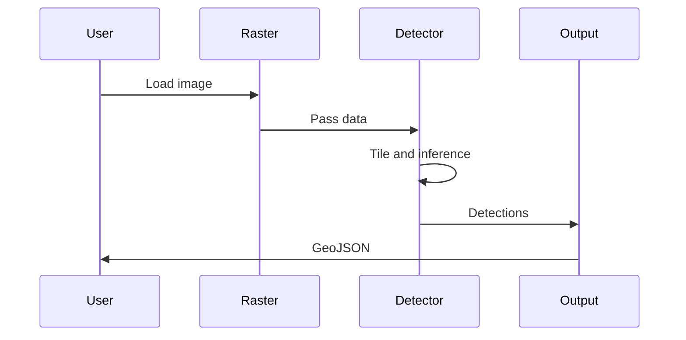

# Object Detection Tutorial

This tutorial demonstrates how to detect objects in satellite imagery.

## Overview

| Component | Description |
|-----------|-------------|
| Input | Satellite imagery (GeoTIFF, COG) |
| Model | Pre-trained detection model |
| Output | GeoJSON with detections |

## Prerequisites

```bash
pip install unbihexium[all]
```

## Step 1: Load Data

```python
from unbihexium.core.raster import Raster

raster = Raster.from_file("satellite_image.tif")
print(f"Shape: {raster.shape}")
print(f"CRS: {raster.metadata.crs}")
```

## Step 2: Initialize Detector

```python
from unbihexium.ai.detection import ShipDetector

detector = ShipDetector(threshold=0.5)
```

## Step 3: Run Detection

```python
result = detector.predict(raster)

print(f"Found {result.count} ships")
for det in result.detections:
    print(f"  {det.class_name}: {det.confidence:.2f}")
```

## Step 4: Export Results

```python
import json

geojson = result.to_geojson()
with open("detections.geojson", "w") as f:
    json.dump(geojson, f)
```

## Pipeline Diagram



## Detection Formula

The detection confidence is computed using non-maximum suppression:

$$IoU = \frac{Area_{intersection}}{Area_{union}}$$

Boxes with $IoU > 0.5$ are suppressed.

## CLI Usage

```bash
unbihexium pipeline run ship_detection -i input.tif -o output.geojson
```

## Next Steps

- Try different detection models
- Adjust confidence threshold
- Explore change detection
