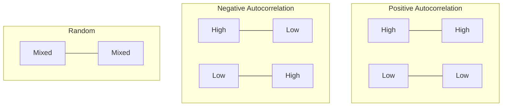

# Geostatistics Tutorial

Advanced spatial analysis with variograms, Kriging, and spatial autocorrelation.

## Overview

| Method | Purpose | Output |
|--------|---------|--------|
| Variogram | Analyze spatial correlation | Fitted model |
| Kriging | Spatial interpolation | Predicted surface |
| Moran's I | Spatial autocorrelation | Statistical test |

## Variogram Analysis

The semivariogram $\gamma(h)$ measures spatial dissimilarity at distance $h$:

$$\gamma(h) = \frac{1}{2N(h)} \sum_{i=1}^{N(h)} [z(x_i) - z(x_i + h)]^2$$

### Variogram Models

| Model | Function | Behavior |
|-------|----------|----------|
| Spherical | $\gamma(h) = c_0 + c_1[1.5(h/a) - 0.5(h/a)^3]$ | Linear then flat |
| Exponential | $\gamma(h) = c_0 + c_1[1 - e^{-h/a}]$ | Gradual asymptote |
| Gaussian | $\gamma(h) = c_0 + c_1[1 - e^{-(h/a)^2}]$ | Smooth parabolic |

Where: $c_0$ = nugget, $c_1$ = sill, $a$ = range

### Example Code

```python
from unbihexium.geostat import Variogram, VariogramModel
import numpy as np

# Sample data
np.random.seed(42)
coords = np.random.rand(100, 2) * 100
values = np.sin(coords[:, 0] / 10) + np.random.rand(100) * 0.1

# Fit variogram
variogram = Variogram(n_lags=15, model=VariogramModel.SPHERICAL)
result = variogram.fit(coords, values)

print(f"Nugget: {result.nugget:.4f}")
print(f"Sill: {result.sill:.4f}")
print(f"Range: {result.range_param:.4f}")
```

## Kriging Interpolation

Ordinary Kriging predicts values at unsampled locations:

$$\hat{Z}(x_0) = \sum_{i=1}^{n} \lambda_i Z(x_i)$$

Subject to: $\sum_{i=1}^{n} \lambda_i = 1$

### Kriging Example

```python
from unbihexium.geostat import OrdinaryKriging

# Fit Kriging model
kriging = OrdinaryKriging(variogram=variogram)
kriging.fit(coords, values)

# Predict at target locations
targets = np.array([[50, 50], [25, 75], [75, 25]])
result = kriging.predict(targets)

print(f"Predictions: {result.predictions}")
print(f"Variance: {result.variance}")
```

## Spatial Autocorrelation



### Moran's I

$$I = \frac{n}{\sum_i \sum_j w_{ij}} \cdot \frac{\sum_i \sum_j w_{ij}(x_i - \bar{x})(x_j - \bar{x})}{\sum_i (x_i - \bar{x})^2}$$

```python
from unbihexium.geostat import MoransI

moran = MoransI(distance_threshold=20.0)
result = moran.calculate(coords, values)

print(f"Moran's I: {result.statistic:.4f}")
print(f"Z-score: {result.z_score:.4f}")
print(f"P-value: {result.p_value:.4f}")
```
