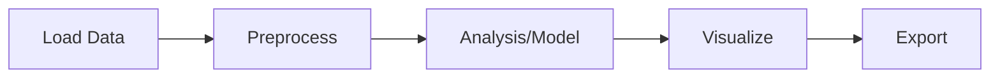

# Tutorials

This section provides hands-on tutorials for using unbihexium.

## Available Tutorials

| Tutorial | Description | Difficulty |
|----------|-------------|------------|
| [Object Detection](detection.md) | Detect objects in satellite imagery | Intermediate |
| [Spectral Indices](indices.md) | Calculate vegetation and water indices | Beginner |
| [Geostatistics](geostat.md) | Variogram analysis and Kriging | Advanced |

## Prerequisites

Before starting, ensure you have:

1. Installed unbihexium: `pip install unbihexium`
2. Basic familiarity with Python and NumPy
3. Sample data (provided in tutorials)

## Workflow Diagram

## Formula Reference

Common formulas used across tutorials:

**NDVI**: $$NDVI = \frac{NIR - RED}{NIR + RED}$$

**Semivariance**: $$\gamma(h) = \frac{1}{2N(h)} \sum_{i=1}^{N(h)} [z(x_i) - z(x_i + h)]^2$$
