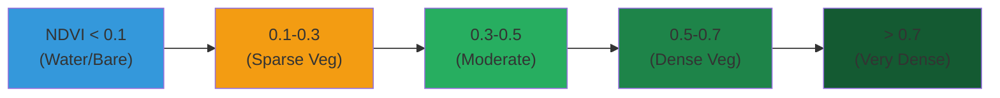

# Spectral Indices Tutorial

Learn how to calculate vegetation, water, and other spectral indices.

## Available Indices

| Index | Formula | Application |
|-------|---------|-------------|
| NDVI | $(NIR - RED) / (NIR + RED)$ | Vegetation health |
| NDWI | $(GREEN - NIR) / (GREEN + NIR)$ | Water bodies |
| NBR | $(NIR - SWIR2) / (NIR + SWIR2)$ | Burn severity |
| EVI | $G \times (NIR - RED) / (NIR + C_1 \times RED - C_2 \times BLUE + L)$ | Enhanced vegetation |
| SAVI | $((NIR - RED) / (NIR + RED + L)) \times (1 + L)$ | Soil-adjusted vegetation |
| MSI | $SWIR1 / NIR$ | Moisture stress |

## NDVI Calculation

The Normalized Difference Vegetation Index (NDVI) is calculated as:

$$NDVI = \frac{NIR - RED}{NIR + RED}$$

Where:
- $NIR$ = Near-infrared reflectance
- $RED$ = Red reflectance

## Example Code

```python
from unbihexium.core.index import compute_index, IndexRegistry
import numpy as np

# Create sample band data
bands = {
    "NIR": np.random.rand(256, 256) * 0.8,
    "RED": np.random.rand(256, 256) * 0.5,
    "GREEN": np.random.rand(256, 256) * 0.4,
}

# Calculate NDVI
ndvi = compute_index("NDVI", bands)

print(f"NDVI range: [{ndvi.min():.3f}, {ndvi.max():.3f}]")
print(f"Mean NDVI: {ndvi.mean():.3f}")
```

## Index Interpretation



## CLI Usage

```bash
unbihexium index NDVI -i input.tif -o ndvi_output.tif
```

## Multi-Index Analysis

```python
# Calculate multiple indices
indices_to_compute = ["NDVI", "NDWI", "MSI"]

for index_name in indices_to_compute:
    result = compute_index(index_name, bands)
    print(f"{index_name}: mean={result.mean():.3f}")
```

## Next Steps

- Combine indices for classification
- Time series analysis
- Anomaly detection
