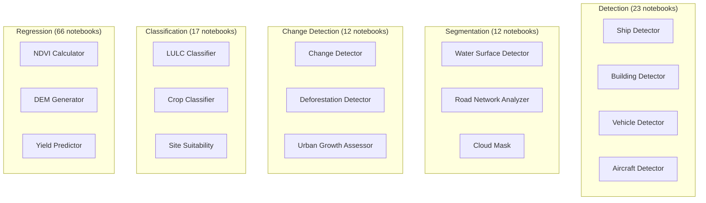

# Notebooks Tutorial

## Purpose

Guide to using the Unbihexium Jupyter notebooks for learning, exploration, and model demonstration.

## Overview

The Unbihexium library includes **130 comprehensive notebooks** covering all model topics in the Model Zoo. Each notebook demonstrates:

- All 4 model variants (tiny, base, large, mega)
- Both ONNX and PyTorch inference
- Performance benchmarking
- Integration examples
- Best practices

## Prerequisites

- Python 3.10+
- Jupyter Notebook or JupyterLab
- unbihexium installed

## Notebook Architecture



## Notebook Categories

| Category | Count | Description |
|----------|-------|-------------|
| Detection | 23 | Object detection and localization |
| Segmentation | 12 | Pixel-wise classification |
| Change Detection | 12 | Bi-temporal change analysis |
| Classification | 17 | Scene and object classification |
| Regression | 66 | Continuous value prediction |
| **Total** | **130** | **520 model variants** |

## Time Investment

$$T_{total} = \sum_{i=1}^{130} T_i \approx 65 \text{ hours (complete coverage)}$$

Each notebook takes approximately 30 minutes to complete.

## Quick Start Notebooks

| # | Notebook | Task | Duration |
|---|----------|------|----------|
| 069 | [ndvi_calculator](../../examples/notebooks/069_ndvi_calculator.ipynb) | Regression | 30 min |
| 101 | [ship_detector](../../examples/notebooks/101_ship_detector.ipynb) | Detection | 30 min |
| 006 | [building_detector](../../examples/notebooks/006_building_detector.ipynb) | Detection | 30 min |
| 009 | [change_detector](../../examples/notebooks/009_change_detector.ipynb) | Change Detection | 30 min |
| 056 | [lulc_classifier](../../examples/notebooks/056_lulc_classifier.ipynb) | Classification | 30 min |

## Installation

```bash
# Install dependencies
pip install unbihexium jupyter onnxruntime torch

# Navigate to notebooks
cd examples/notebooks

# Start Jupyter
jupyter notebook
```

## Notebook Contents

Each notebook includes:

1. **Header**: Colab badge, GitHub link, version info
2. **Introduction**: Model description and use cases
3. **Model Overview**: Technical specifications and variants
4. **Environment Setup**: Installation and verification
5. **Model Loading**: via Model Zoo, ONNX, and PyTorch
6. **Variant Comparison**: Size, parameters, resolution
7. **Inference Pipeline**: Input preparation and execution
8. **Performance Benchmarks**: Timing analysis
9. **Integration Examples**: Batch processing, model selection
10. **Best Practices**: Deployment recommendations

## Running in Colab

[](https://colab.research.google.com/github/unbihexium-oss/unbihexium/blob/main/examples/notebooks/)

Each notebook includes a Colab badge for one-click cloud execution. No local setup required.

## Model Variants

| Variant | Resolution | Use Case |
|---------|------------|----------|
| tiny | 32x32 | Edge devices, prototyping |
| base | 64x64 | Production deployments |
| large | 128x128 | High accuracy applications |
| mega | 256x256 | Research, maximum precision |

## Full Notebook Index

See [examples/notebooks/README.md](../../examples/notebooks/README.md) for the complete index of all 130 notebooks organized by category.

## Related Documentation

- [API Reference](../reference/api.md)
- [CLI Reference](../reference/cli.md)
- [Model Zoo Catalog](../model_zoo/model_catalog.md)
- [Getting Started](../getting_started/quickstart.md)

---

**Copyright 2025 Unbihexium OSS Foundation. Apache-2.0 License.**
