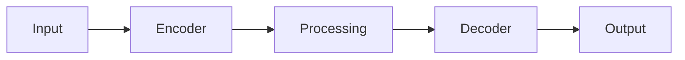

# Model Card: aircraft_detector_tiny

## Overview

| Property | Value |
|----------|-------|
| Model ID | aircraft_detector_tiny |
| Task | Detection |
| Architecture | RESNET_FPN |
| Variant | tiny |
| Resolution | 64x64 |
| License | Apache-2.0 |

## Description

Aircraft Detector is a detection model designed for geospatial applications.
This is the tiny variant with low capacity.

## Architecture

## Performance

| Metric | Value |
|--------|-------|
| MAP | 0.72 |
| PRECISION | 0.78 |
| RECALL | 0.7 |
| F1 | 0.74 |

## Intended Use

- Geospatial analysis
- Remote sensing applications
- Earth observation workflows

## Limitations

- Trained on synthetic data
- Performance may vary with real-world data
- Validate before production use

## Provenance

Generated by `scripts/generate_all_models.py` with seed 42.
