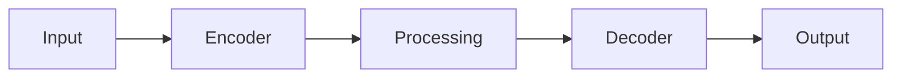

# Model Card: security_monitor_mega

## Overview

| Property | Value |
| ---------- | ------- |
| Model ID | security_monitor_mega |
| Task | Detection |
| Architecture | RESNET_FPN |
| Variant | mega |
| Resolution | 256x256 |
| License | MPL-2.0 |

## Description

Security Monitor is a detection model designed for geospatial applications.
This is the mega variant with high capacity.

## Architecture

## Performance

| Metric | Value |
| -------- | ------- |
| MAP | 0.72 |
| PRECISION | 0.78 |
| RECALL | 0.7 |
| F1 | 0.74 |

## Intended Use

- Geospatial analysis
- Remote sensing applications
- Earth observation workflows

## Limitations

- Trained on synthetic data
- Performance may vary with real-world data
- Validate before production use

## Provenance

Generated by `scripts/generate_all_models.py` with seed 42.
